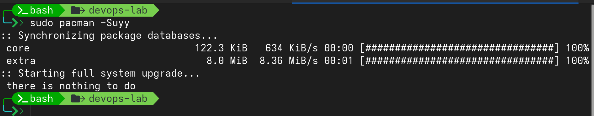
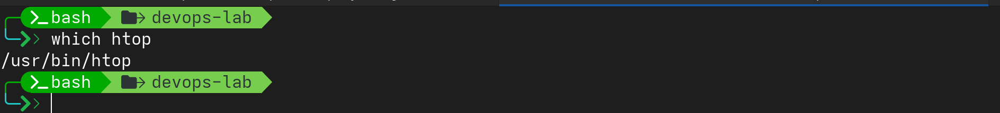

## Task2: Package Management

1. Update your package index

- Command
```bash
    sudo pacman -Suyy
```
- Output:
    

---

2. Install htop (system monitoring tool)

- Command
```bash
sudo pacman -S htop
which htop
```
- Output:
    

---

3. Check if nginx is installed. If not, list the command you would use to install it (DON'T actually install if you don't have sudo)

- Command
```bash
    sudo pacman -S nginx
    pacman -Qt | grep nginx
```
- Output:
    
---

4. List all currently installed packages and save the output to devops-lab/packages.txt

- Command

```bash
    pacman -Qt >> ~/devops-lab/packages.txt
    tail devops-lab/packages.txt
```
- Output:
    

---