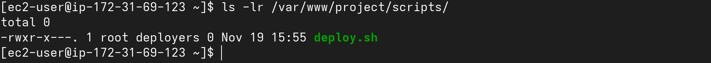
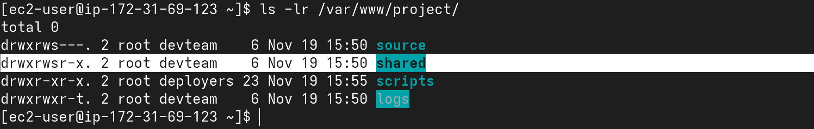

# Task 3: Apply Correct Permissions

1. **Set permissions so that:**
```bash
    -   Only members of `devteam` can enter and modify `/var/www/project/source/`
    -   The directory should have correct **group ownership** and **SGID** so newfiles inherit the group.
    -   Default umask for `devteam` members should be `002` (rwxrwxr-x for dirs,
rw-rw-r-- for files)
```

- Commands

```bash
sudo chown -R root:devteam /var/www/project/source
sudo chmod 2770 /var/www/project/source
```
- Output

---

2. **For `/var/www/project/logs/`:**
```bash
    -   Everyone in `devteam` can append to logs
    -   No one can delete or modify others’ log files → use **sticky bit**
```

- Commands

```bash
sudo chown root:devteam /var/www/project/logs
sudo chmod 1775 /var/www/project/logs
```
- Output


---

3. **For `/var/www/project/scripts/deploy.sh` :**
```bash
    -   Only the `deployer` user should be able to execute it
    -   Use **SUID** so it runs with owner privileges (assume owner is root or deploy)
```

- Commands

```bash
sudo chown deploy:deployers /var/www/project/scripts/deploy.sh
sudo chmod 4750 /var/www/project/scripts/deploy.sh

```
- Output

---

4. **For `/var/www/project/shared/` :**
```bash
    -   All `devteam` members can read and write
    -   Use **setgid** so all new files created belong to `devteam` group
automatically
```

- Commands

```bash
sudo chown root:devteam /var/www/project/shared
sudo chmod 2775 /var/www/project/shared
```
- Output

---
