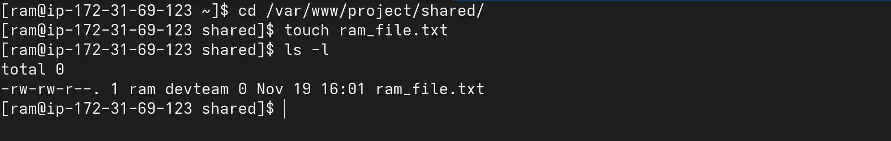
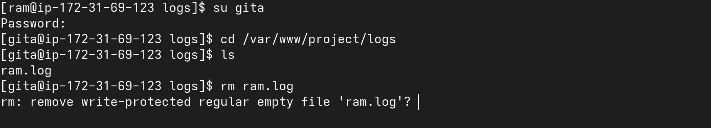

# Task 5: Verification & Testing
1. **As user `ram` , create a file in `shared/` and verify:**
```bash
    -   Group ownership is `devteam`
    -   Permissions are `664` (or `775` for directories)
```
- Command

```bash
su ram
cd 
cd /var/www/project/shared
touch ram_file.txt
```

- Output


---

2. **As user `gita` , try to delete a file created by `ram` in `logs/` → should fail due to sticky bit.**

- Command

```bash
su ram
cd
cd /var/www/project/logs
touch ram.log
su gita
cd
cd /var/www/project/logs
rm ram.log
```

- Output



---

3. **As user `deploy` , execute the `deploy.sh` script successfully even if not owner.**

- Command

```bash
su deploy
cd
/var/www/project/scripts/deploy.sh
```

- Output


---