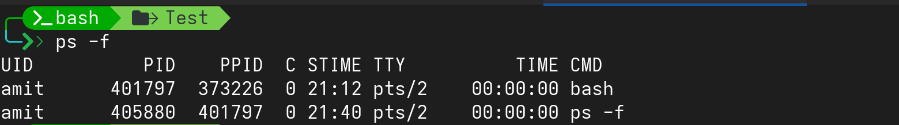

# Understanding The Shell

The job of the shell is to interpret or analyze the commands given by users. A shell accepts commands from the user and transforms them into a form that is understandable to the kernel. Shell is either interactive or non-interactive shell.

---

##  Interactive Shell

- A shell that accepts commands from the user via a terminal (TTY) and displays the output immediately.
- Reads startup files during activation (like .bashrc, .bash_profile).
- Displays a prompt (usually set in the $PS1 variable).
- Enables job control by default (so we can run processes in the background or foreground, suspend, resume, etc.).
- Named “interactive” because the user interacts with it directly.

**We can start an interactive shell by giving the name of the shell after we logged into the system.**
```bash
bash
```

---

## Non-Interactive Shell

- No user interaction: It executes commands automatically, without prompting the user.
- Startup files: .bashrc and .profile are not executed automatically.
- PATH considerations: Influences the PATH variable. It’s recommended to use full paths for commands to avoid issues.
- Background execution: Non-interactive scripts can run smoothly in the background.
- Login type: Generally a non-login shell, because the user has already logged in.
- Script execution: Any shell that runs a script is considered non-interactive.

---

## Interactive vs Non-Interactive Shell

| Feature                     | Interactive Shell                                   | Non-Interactive Shell                                  |
|------------------------------|---------------------------------------------------|------------------------------------------------------|
| **Definition**               | Shell that interacts with the user via terminal. | Shell that runs scripts or commands automatically without user interaction. |
| **User Input**               | Accepts commands from the user.                  | Does not accept user input.                          |
| **Prompt**                   | Displays prompt (`$PS1`).                        | No prompt is displayed.                              |
| **Startup Files**            | Reads `.bashrc`, `.profile` or `.bash_profile`.  | Startup files are **not automatically executed**.   |
| **Job Control**              | Enabled by default (foreground, background, suspend). | Usually disabled.                                   |
| **Background Execution**     | Can run background jobs manually.                | Scripts can run smoothly in the background.         |
| **Typical Use Cases**        | Terminal session, SSH login, interactive menu.   | Scripts, cron jobs, automated tasks, init scripts.  |
| **Command Paths**            | Can use aliases and commands defined in startup files. | Should use **full paths** for commands to avoid PATH issues. |
| **Examples**                 | `bash` in terminal, `ssh` session.              | `./script.sh`, cron job, system startup scripts.    |

---

## Parent and Child Shell Relationship

The default interactive shell started when a user logs into a virtual console terminal or starts a terminal emulator in the GUI is a parent shell.

When the /bin/bash command or the equivalent bash command is entered at the CLI
prompt, a new shell program is created. This is a child shell. A child shell is also called a subshell. A subshell can be created from a parent shell, and a
subshell can be created from another subshell. 

- Example
```bash
ps -f
```



---

## Creatively Using Subshell

Subshells are often used for multi-processing in shell scripts. However, entering into a sub-shell is an expensive method and can significantly slow down processing. Subshell issues exist also for an interactive CLI shell session. It is not truly multi-processing, because the terminal gets tied up with the subshell’s I/O.

One productive subshell method in the interactive shell uses background mode. Running a command in background mode allows the command to be processed and frees up
your CLI for other use

- Running a command in background
```bash
sleep 10 &          # & symbol at the end makes the command run in background
```
Be aware that a background job’s completion status won’t necessarily wait till a convenient time to display itself. Completion status just suddenly appears on screen.

---

## Creating a Process List

A process list is a command grouping type. Process list
created a subshell to execute the commands

- Creating a process list
```bash
pwd; cd; pwd; ls        # command list
(pwd; cd ; pwd; ls)     # process list
```

- Running process list in background
```bash
(pwd; cd; pwd; ls) &
```

---

## External Commands

An external command, sometimes called a filesystem command, is a program that exists
outside of the bash shell. They are not built into the shell program. An external command program is typically located in /bin, /usr/bin, /sbin, or /usr/sbin.

Whenever an external command is executed, a child process is created. This action is
termed forking.

- Check
```bash
type ps         # we get path of ps
```
---

## Built-in Commands

When using a built-in command, no forking is required. Therefore, built-in commands are
less expensive. Built-in commands are different in that they do not need a child process to execute. They were compiled into the shell and thus are part of the shell’s toolkit. No external program file exists to run them. 

- Check
```bash
type cd             # says cd is built-in
```


Using subshells at the command line can allow for creative and productive use of the CLI. Subshells can be nested, spawning grandchild shells and great-grandchild shells.Creating a subshell is an expensive process as a new environment for the shell must be created as well.

---