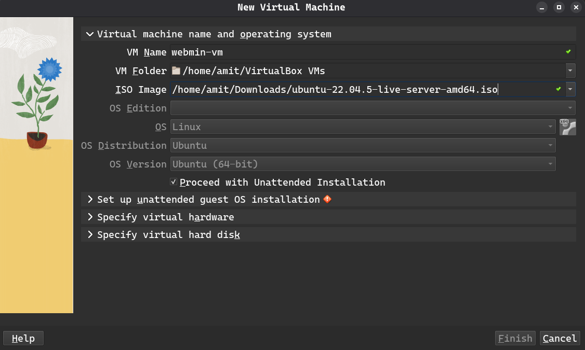
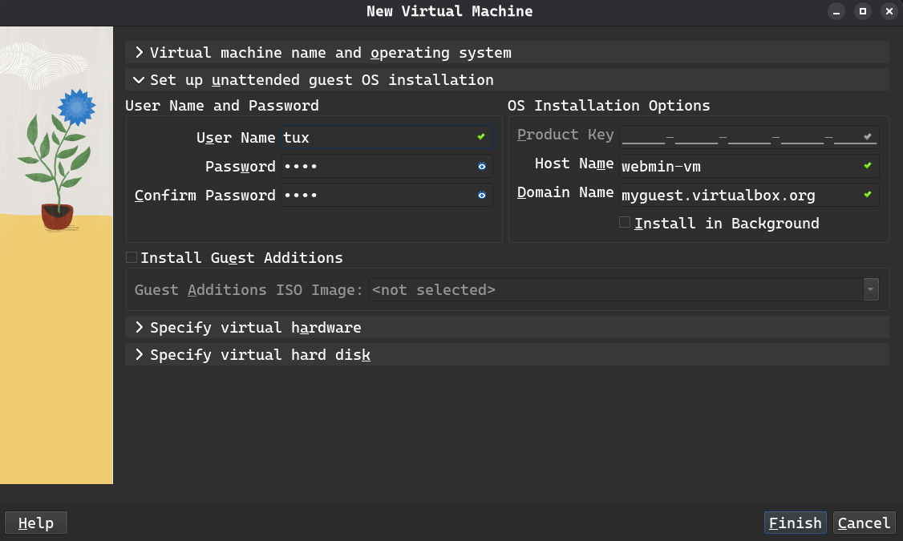
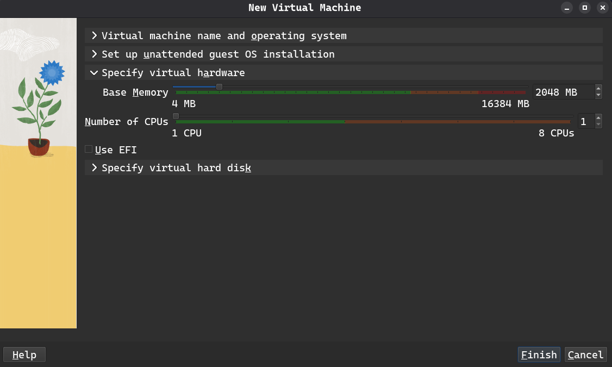
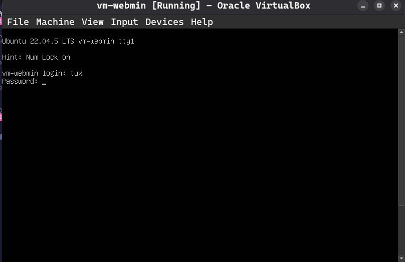
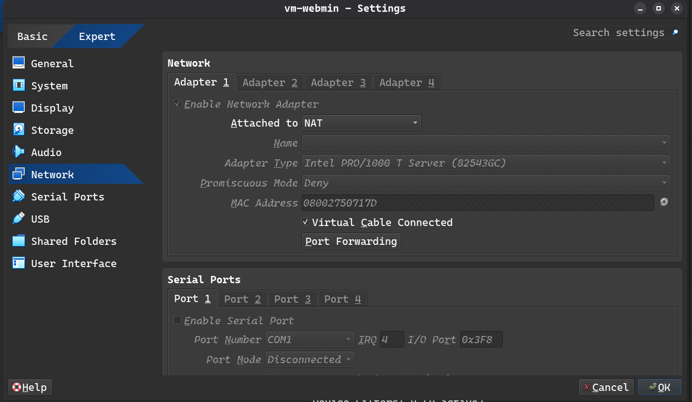
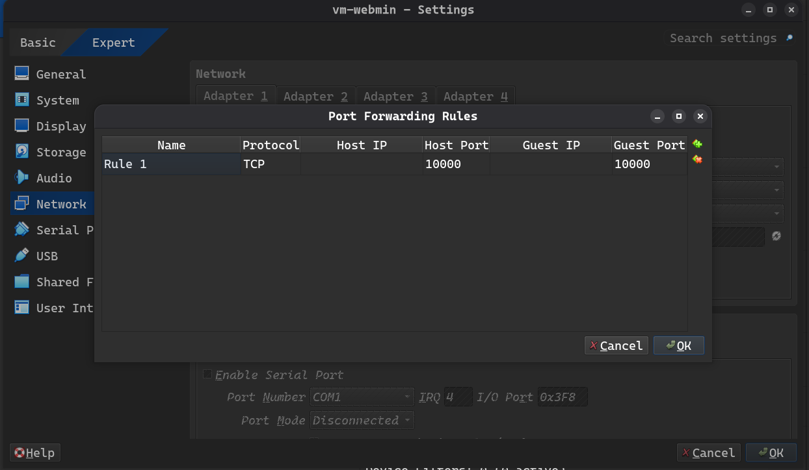
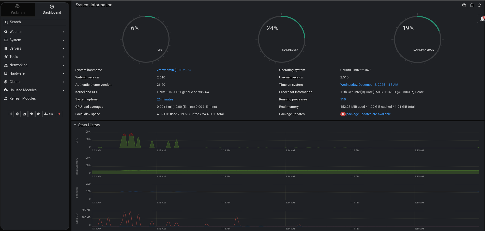

# Task 1: Setup webmin in VM

Webmin is a web-based control panel for system administrators to manage Unix-like servers through a web browser.

## Setup VirtualBox 

1. Install VirtualBox and kernel moudles 
```bash
# Install virtual box
sudo pacman -S virtualbox
# Install essential kernel modules required for  VirtualBox
sudo pacman -S virtualbox-host-modules-lts # For lts Kernel
```

2. Load the VirtualBox kernel modules
```bash
sudo modprobe vboxdrv
sudo modprobe vboxnetadp
sudo modprobe vboxnetfilt
```

3. Add the user to vboxusers group
```bash
sudo usermod -aG vboxusers $USER
```
--- 

## Setup VM

1. Install iso for Ubuntu Server
```bash
wget https://releases.ubuntu.com/jammy/ubuntu-22.04.5-live-server-amd64.iso 
```

2. Open VirtualBox GUI
```bash
virtualbox 
```

3. Create VM 

- Give a name to VM, VM Folder and select iso 



- Setup user 



- Specify virtual hardware i.e RAM and CPU



- Specify virtual hard disk


- Proceed with finish


4. Start the VM and login



5. Update the vm 
```bash
sudo apt-get update     # refresh packages list
sudo apt-get upgrade    # upgrade install packages
```
---

## Setup webmin in VM

[Visit: https://webmin.com/download](https://webmin.com/download/)

```bash
# Install webmin 
curl -o webmin-setup-repo.sh https://raw.githubusercontent.com/webmin/webmin/master/webmin-setup-repo.sh
sudo sh webmin-setup-repo.sh

sudo apt-get install --install-recommends webmin usermin

# Check status of webmin
sudo systemctl status webmin 
```
---

## Network Setup

1. Shutdown the VM
```bash
shutdown -h now
```

2. Update Network setting for VM

- Select NAT 



- Add port forwarding rule



3. Start the VM

5. Check the status of webmin
```bash
sudo systemctl status webmin # should be active
```
---

## Access from host browser

1. Open localhost:10000 in web browser

3. Sign in to the server


4. The dashboard view



5. Monitor and manage with webmin

---