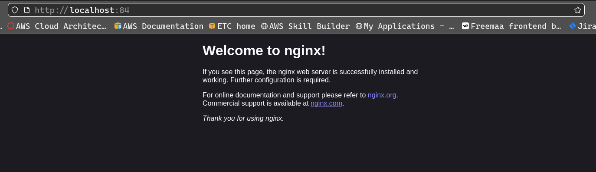
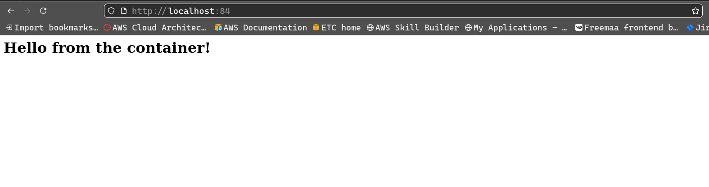
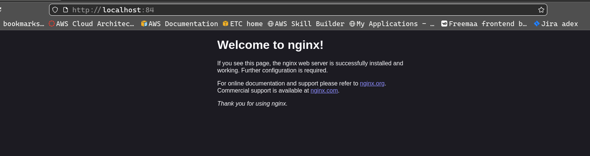
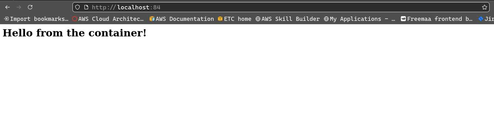

# Task 1: Data Persistance in Containers
- Pull a NGINX or httpd container.
- Browse the default page in http://localhost
- Alter the default content.
- Stop and start the container again and check if the content persists.
- Remove the container and spin it again and check the persistence again.
- If content does not persist, try different ways to make it persistence

--- 

## Running The Container

1. **Pull  NGINX image**
```bash 
docker pull nginx
```
---
2. **Create and Run container**
```bash
docker run --name mycont -p 84:80 -d nginx
```


---

3. **Alter the default content**

- Add the html files
```bash
# Open interactive terminal 
docker exec -it mycont /bin/bash

# Create a directory for custom content ( inside container)
mkdir -p /var/www/html
exit

# Copy content from host to container 
docker cp index.html mycont:/var/www/html
docker cp error.html mycont:/var/www/html
```
- Create a custom config file for nginx 
```bash
# content of nginx_custom.conf file
server {
    listen       80;
    listen  [::]:80;
    server_name  localhost;

    #access_log  /var/log/nginx/host.access.log  main;

    location / {
        root   /var/www/html;
        index  index.html index.htm;
    }

    error_page   500 502 503 504  /error.html;
    location = /50x.html {
        root   /var/www/html;
    }

}
```

- Copy the custom config file to the container
```bash
docker cp nginx_custom.conf mycont:/etc/conf.d/custom.conf
```

- Restart the container 
```bash
docker restart mycont
```


---

4. **Start and Stop the container**
```bash
docker stop mycont
docker start mycont
```


Container persists.

---

5. **Remove the container**
```bash
# Stop the container
docker stop mycont

# Remove th container
docker rm mycont
```
---

6. **Running the container again**
```bash
docker run --name mycont -p 84:81 -d nginx
```


---

7. **Cleaning up**
```bash
docker stop mycont
docker rm mycont
docker rmi nginx
```
---

## Making The Container Persist

8. **Directory Structure** 
```bash
nginx
├── config
│   └── nginx_custom.conf
├── docker-compose.yaml
└── src
    ├── error.html
    └── index.html
```
---

9. **Content of ngix_custom.conf**
```bash
server {
    listen       80;
    listen  [::]:80;
    server_name  localhost;

    #access_log  /var/log/nginx/host.access.log  main;

    location / {
        root   /var/www/html;
        index  index.html index.htm;
    }

    error_page   500 502 503 504  /error.html;
    location = /50x.html {
        root   /var/www/html;
    }

}
```
---

10. **Content of docker-compose.yaml**
```bash
services:
  nginx:
    image: nginx:latest
    container_name: mycont
    ports:
      - 84:80
    volumes:
      - ./src:/var/www/html
      - ./config/nginx_custom.conf:/etc/nginx/conf.d/custom.conf
```
---

11. **Spin up the container using docker-compose**
```bash
docker comopse up -d
```


---

12. **Cleaning up with docker-compose**
```bash
docker compose down
```


---