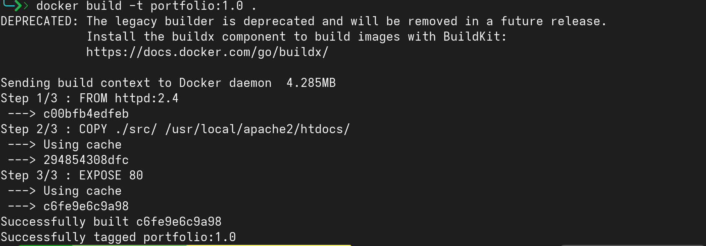
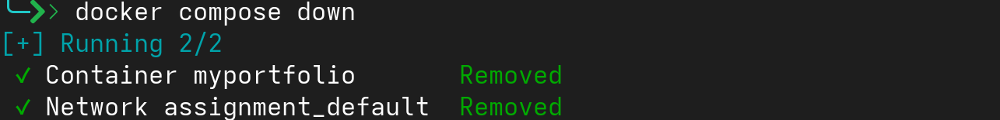

# Docker Image That Runs Portfolio Website

---

1. **Directory Structure**
```bash
.
├── BuildPortfolioImage.md
├── docker-compose.yaml
├── Dockerfile
└── src/
```

---

2. **Content of Dockerfile**
```bash
# Base image
FROM httpd:2.4

# Copy website content
COPY ./src/ /usr/local/apache2/htdocs/

# Expose port 80 for web access
EXPOSE 80
```

---

3. **Build docker image**
```bash
docker build -t portfolio:1.0 .
```



---

4. **List docker images**
```bash
docker images
```


---

5. **Content of docker-compose file**
```bash
services:
  web:
    image: portfolio:1.0
    container_name: myportfolio
    ports:
      - "84:80"
```

---

6. **Running the container**
```bash
docker compose up -d
```


---

7. **Cleaning up**
```bash
docker compose down
```

---