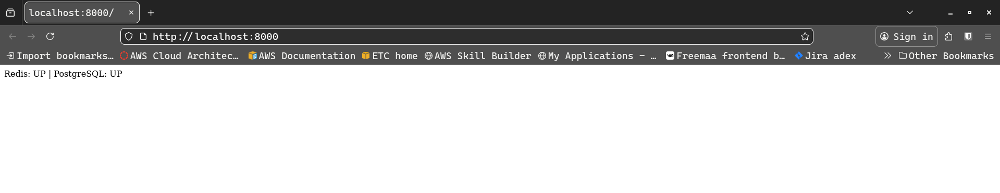

# Task: Ping Redis and Database Container From Python Webapp

1. **Directory structure**
```bash
.
├── app.py
├── docker-compose.yaml
└── requirements.txt
└── .env_file
```
---

2. **app.py**
```bash
from flask import Flask
import psycopg2
import redis
import os
from dotenv import load_dotenv

# Load .env variables
load_dotenv()

app = Flask(__name__)

# Redis client
r = redis.Redis(
    host=os.getenv("REDIS_HOST"),
    port=int(os.getenv("REDIS_PORT"))
)

# PostgreSQL credentials
DB_CONFIG = {
    "dbname": os.getenv("DB_NAME"),
    "user": os.getenv("DB_USER"),
    "password": os.getenv("DB_PASSWORD"),
    "host": os.getenv("DB_HOST"),
    "port": int(os.getenv("DB_PORT"))
}

@app.route("/")
def check_services():
    redis_status = "UP"
    db_status = "UP"

    # Check Redis
    try:
        r.ping()
    except:
        redis_status = "DOWN"

    # Check PostgreSQL
    try:
        conn = psycopg2.connect(**DB_CONFIG)
        cursor = conn.cursor()
        cursor.execute("SELECT 1;")
        cursor.fetchone()
        cursor.close()
        conn.close()
    except:
        db_status = "DOWN"

    return f"Redis: {redis_status} | PostgreSQL: {db_status}"

if __name__ == "__main__":
    app.run(host="0.0.0.0", port=8000)
```
---

3. **docker-compose.yaml**
```bas
services:

  web:
    image: python:3.10-slim
    container_name: demo_web
    working_dir: /app
    volumes:
      - .:/app
    command: >
      sh -c "pip install -r requirements.txt && python app.py"
    ports:
      - "8000:8000"
    networks:
      - app_net
    depends_on:
      - redis
      - database
    env_file:
      - ./.env_file     

  redis:
    image: redis:7
    container_name: redis
    volumes:
      - redis_log:/var/log/redis
    networks:
      - app_net
    env_file:
      - ./.env_file     

  database:
    image: postgres:16
    container_name: demo_database
    env_file:
      - ./.env_file      
    volumes:
      - db_data:/var/lib/postgresql/data
    ports:
      - "5432:5432"
    networks:
      - app_net

volumes:
  redis_log:
  db_data:

networks:
  app_net:
    driver: bridge
```
---
4. **requirements.txt**
```bash
flask
redis
psycopg2-binary
python-dotenv
```

---

5. **.env_file**
```bash
# .env_file
# Database
DB_NAME=demo_database
DB_USER=amit
DB_PASSWORD=password123
DB_HOST=database
DB_PORT=5432

# Redis
REDIS_HOST=redis
REDIS_PORT=6379
```
---

6. **Running and testing**
```bash
docker compose up -d
```

---