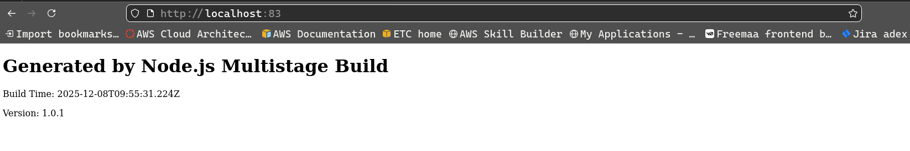
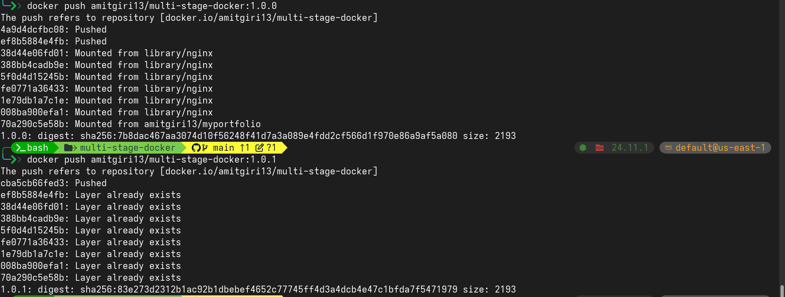

# Task 1: Containerize NodeJS App with Multi Stage Docker Build

1. **Directory Structure**
```bash
.
├── build.js
├── Dockerfile
├── package.json
├── .env
└── src
    └── template.html
```
---

2. **build.js**
```bash
const fs = require("fs");
const path = require("path");
require("dotenv").config();

const template = fs.readFileSync("./src/template.html", "utf8");


const distPath = path.join(__dirname, "dist");

if (!fs.existsSync(distPath)) {
    fs.mkdirSync(distPath, { recursive: true });
}

const html = template
  .replace("{{title}}", "My Static Site")
  .replace("{{header}}", "Generated by Node.js Multistage Build")
  .replace("{{buildTime}}", new Date().toISOString())
  .replace("{{version}}", process.env.APP_VERSION || "dev");

fs.writeFileSync("./dist/index.html", html);

console.log("index.html generated!");
```

---

3. **package.json**
```bash
{
  "name": "static-site-builder",
  "version": "1.0.0",
  "main": "build.js",
  "scripts": {
    "build": "node build.js"
  },
  "dependencies": {
    "dotenv": "^16.3.1"
  }
}
```

---

4. **template.html**
```bash
<!DOCTYPE html>
<html>
<head>
  <title>{{title}}</title>
</head>
<body>
  <h1>{{header}}</h1>
  <p>Build Time: {{buildTime}}</p>
  <p>Version: {{version}}</p>
</body>
</html>
```

---

5. **Dockerfile**
```bash
# 1st Stage: Build the project
FROM node:22-alpine AS builder     

WORKDIR /app                      

COPY package.json ./              

RUN npm install                  

COPY . .                          

RUN npm run build                 


# 2nd Stage: Run using Nginx
FROM nginx:1.29                    

RUN rm -rf /usr/share/nginx/html/*

COPY --from=builder /app/dist /usr/share/nginx/html  
                                    
EXPOSE 80    
```
---

6. **Setting up .env**
```bash
APP_VERSION=1.0.0
```

---


7. **Building image**
```bash
docker build -t msd-image:1.0.0 .
```


---
8. **Running container**
```bash
docker run --name mycont1 -p 82:80 msd-image:1.0.0
```


---

9. **Setting up .env**
```bash
APP_VERSION=1.0.1
```
---

10. **Building image**
```bash
docker build -t msd-image:1.0.1 .
```

---

11. **Running container**
```bash
docker run --name mycont1 -p 83:80 msd-image:1.0.1
```


---

12. **Pushing image to Repository**
```bash
# tagging images
docker tag msd-image:1.0.0 amitgiri13/multi-stage-docker:1.0.0
docker tag msd-image:1.0.1 amitgiri13/multi-stage-docker:1.0.1

# pushing images
docker push amitgiri13/multi-stage-docker:1.0.0
docker push amitgiri13/multi-stage-docker:1.0.1
```


---