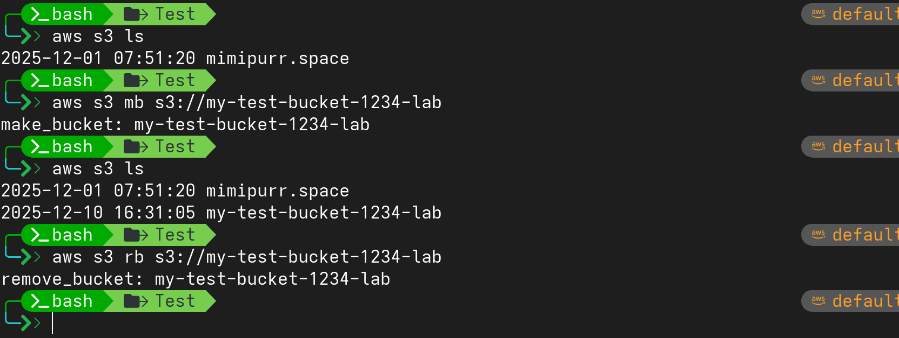

# S3: AWS-CLI 

## Basic commands
```bash
# list buckets
aws s3 ls

# create new bucket
aws mb s3://<bucket_name> 

# create new bucket in specific region
aws mb s3://<bucket_name> --region <reion>

# list bucket objects
aws s3 ls s3://<bucket_name>/
aws s3 ls --hunan-readable s3://<bucket_name>/

# upload file
aws s3 cp <file> s3://<bucket_name>/

# upload folder 
aws s3 cp <folder> s3://<bucket_name>/ --recursive

# download file
aws s3 cp s3://<bucket_name>/<file_name> <path> 

# download folder
aws s3 cp s3://<bucket_name>/folder <path> --recursive 

# sync local file or folder with bucket
aws s3 sync <file/folder> s3://<bucket_name>

# sync bucket with local file or folder
aws s3 sync  s3://<bucket_name> <file/folder>

# delete file
aws s3 rm s3://<bucket_name>/<file_name>

# delete all
aws s3 rm s3://<bucket_name>/ --recursive

# delete bucket
aws s3 rb s3://<bucket_name>
```
---

## Demonstration
```bash
# create bucket
aws s3 mb s3://my-test-bucket-1234-lab

# list bucket
aws s3 ls

# remove bucket
aws s3 rb s3://my-test-bucket-1234-lab

```


---