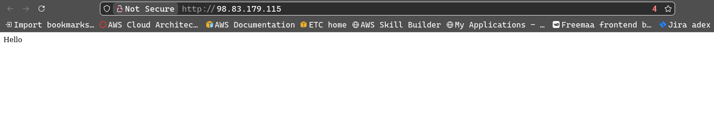

# Task 1: Deploy and document EC2 with CloudFormation with Userdata

---
[CloudFormation Template: ec2-userdata-updated.yaml](./ec2-userdata-updated.yaml)


1. **Install lint*
```bash
# Create and activate virtual envrironment
python -m venv env
source env/bin/activate

# Install lints
pip install yamllint
pip install cfn-lint
```
---

2. **Validate Template**
```bash
# Validate yaml 
yamllint <file.yaml>

# Validate CFT
cfn-lint <file.yaml>
# or
aws clouformation validate-template --template-body file://<file.yaml>
```

---

3. **Deploy CFT**
```bash
aws cloudformation deploy --stack-name <stack-name> --template-file \
<file.yaml> --parameter-overrides KeyPair=<key-pair>
```
---

4. **Output**



---