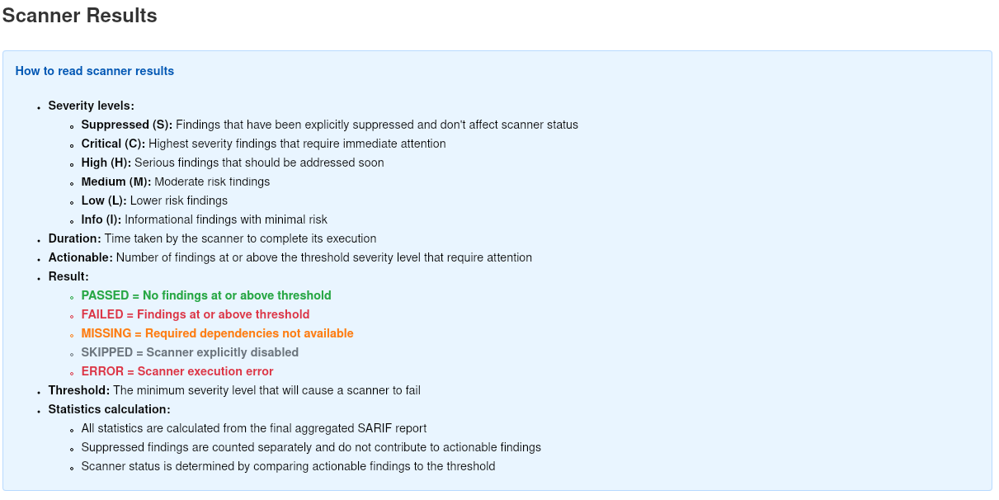
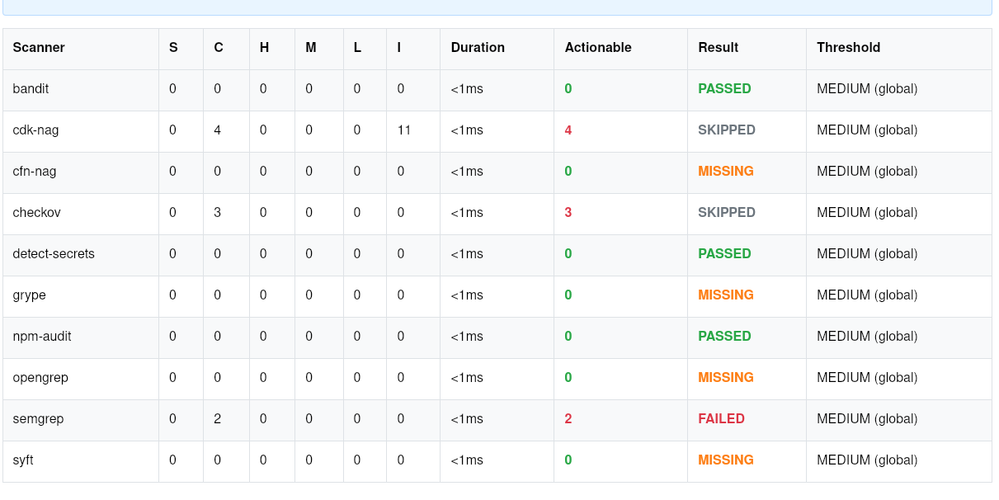
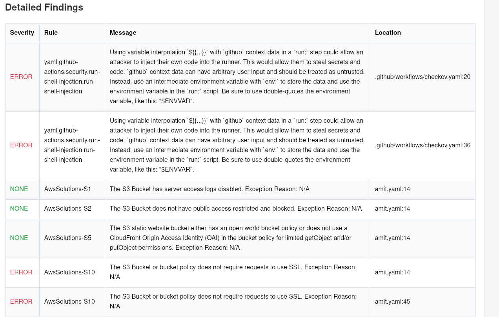
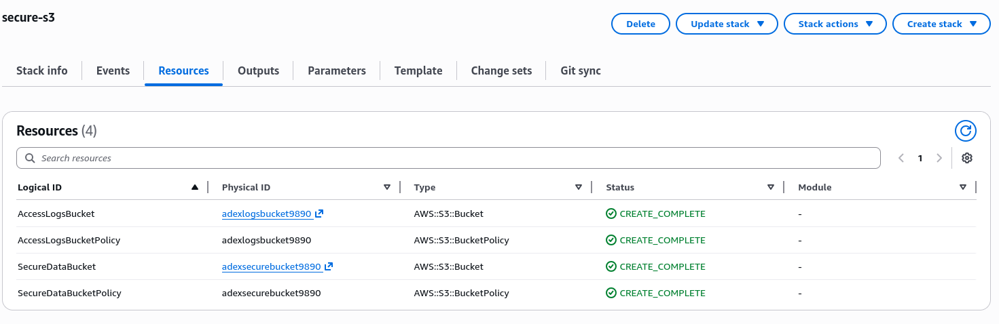
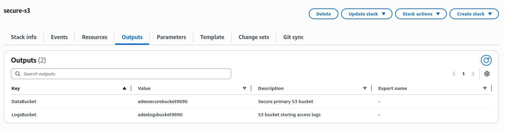

# Task 1: Write a CFT for provisioning a S3 Bucket (AWS). Make it as secure as possible.

## Secure S3 Architecture 


--- 

## Design Summary

- Security-first architecture
- Separation of data and logs
- Encryption at rest
- TLS enforcement
- Public access blocked
- Versioning enabled
- Audit logs preserved on stack deletion

---

## CFT: secure-s3.yaml

```bash
---
AWSTemplateFormatVersion: '2010-09-09'
Description: >
  Secure S3 bucket with access logging enabled.
  Logs are stored in a separate secure S3 bucket.

Parameters:
  DataBucketName:
    Type: String
    Description: Name of the primary S3 bucket

  LogsBucketName:
    Type: String
    Description: Name of the S3 bucket to store access Logs

Resources:

  AccessLogsBucket:
    Type: AWS::S3::Bucket
    DeletionPolicy: Retain
    UpdateReplacePolicy: Retain

    Properties:
      BucketName: !Ref LogsBucketName

      VersioningConfiguration:
        Status: Enabled

      OwnershipControls:
        Rules:
          - ObjectOwnership: BucketOwnerPreferred

      PublicAccessBlockConfiguration:
        BlockPublicAcls: true
        BlockPublicPolicy: true
        IgnorePublicAcls: true
        RestrictPublicBuckets: true

      BucketEncryption:
        ServerSideEncryptionConfiguration:
          - ServerSideEncryptionByDefault:
              SSEAlgorithm: AES256

  AccessLogsBucketPolicy:
    Type: AWS::S3::BucketPolicy

    Properties:
      Bucket: !Ref AccessLogsBucket

      PolicyDocument:
        Version: '2012-10-17'
        Statement:
          - Sid: AllowS3Logging
            Effect: Allow
            Principal:
              Service: logging.s3.amazonaws.com
            Action: s3:PutObject
            Resource: !Sub arn:aws:s3:::${LogsBucketName}/*
            Condition:
              StringEquals:
                aws:SourceAccount: !Ref AWS::AccountId

  SecureDataBucket:
    Type: AWS::S3::Bucket

    Properties:
      BucketName: !Ref DataBucketName

      VersioningConfiguration:
        Status: Enabled

      OwnershipControls:
        Rules:
          - ObjectOwnership: BucketOwnerEnforced

      PublicAccessBlockConfiguration:
        BlockPublicAcls: true
        BlockPublicPolicy: true
        IgnorePublicAcls: true
        RestrictPublicBuckets: true

      LoggingConfiguration:
        DestinationBucketName: !Ref AccessLogsBucket
        LogFilePrefix: data-bucket-access-logs/

      BucketEncryption:
        ServerSideEncryptionConfiguration:
          - ServerSideEncryptionByDefault:
              SSEAlgorithm: AES256

  SecureDataBucketPolicy:
    Type: AWS::S3::BucketPolicy

    Properties:
      Bucket: !Ref SecureDataBucket

      PolicyDocument:
        Version: '2012-10-17'
        Statement:
          - Sid: DenyInsecureTransport
            Effect: Deny
            Principal: "*"
            Action: "s3:*"
            Resource:
              - !Sub arn:aws:s3:::${DataBucketName}
              - !Sub arn:aws:s3:::${DataBucketName}/*
            Condition:
              Bool:
                aws:SecureTransport: false

Outputs:
  DataBucket:
    Description: Secure primary S3 bucket
    Value: !Ref SecureDataBucket

  LogsBucket:
    Description: S3 bucket storing access logs
    Value: !Ref AccessLogsBucket
```
---

## CFT Report








---

## Deploy CFT

```bash
aws cloudformation deploy --template-file secure-s3.yaml \
 --stack-name secure-s3 \
 --capabilities CAPABILITY_NAMED_IAM \
 --parameter-overrides DataBucketName=adexsecurebucket9890 LogsBucketName=adexlogsbucket9890
```

---

## Output 



