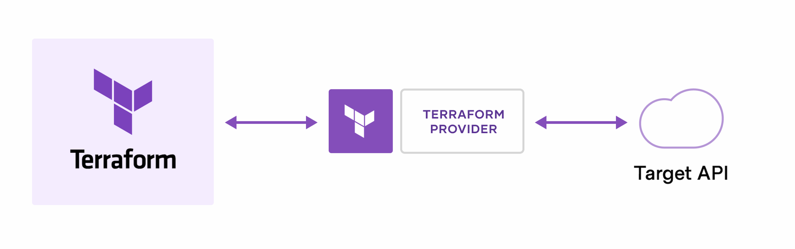
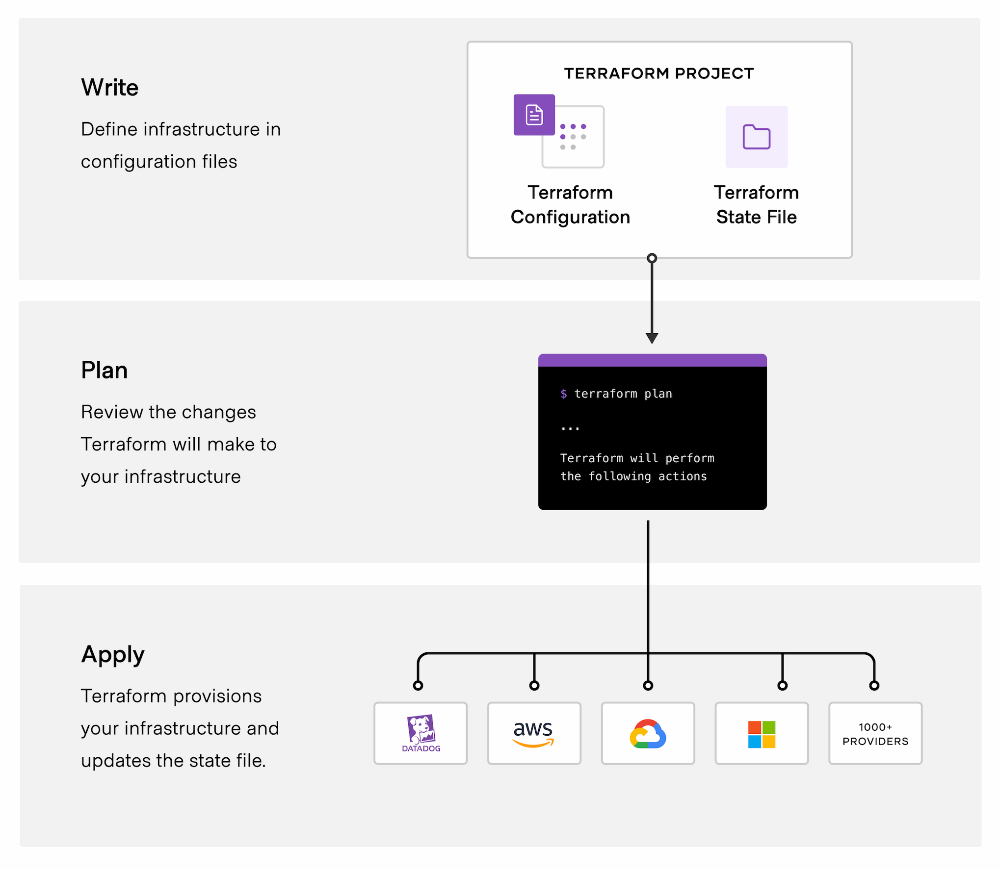
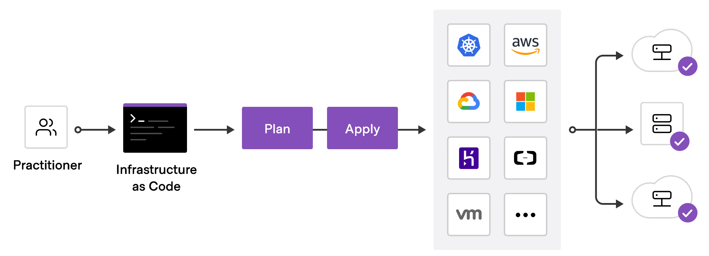

# What is Terraform?

[Visit: hashicorp.com/terraform/intro](https://developer.hashicorp.com/terraform/intro)

Terraform is an infrastructure as code tool that lets us buld, change, and version cloud and on-prem resources safely and efficiently.

---

## How does Terraform work?

Terraform creates and manages resources on cloud platforms and other services through their application programming interfaces (APIs). Providers enable Terraform to work with virtually any platform or service with an accessible API.

---
### Terraform core workflow

- **Write** 
    - Define resources

- **Plan**
    - Terraform creates an execution plan describing the infrastructure it wiill **create, update, or destroy**  based on the existing infrastructure and our configurations.

- **Apply**
    - On approval, Terraform performs the proposed operations in the correct order, respecting any resource dependencies - *(declarative)*. 

    
---

## Why Terraform ?

- **Manage any infrastructure** : use built-in or custom providers to manage resources
- **Track your infrastructure** : Terraform creates a plan before changes and uses a state file as the source of truth
- **Automate changes** : Declarative configs define the end state. Terraform handles dependencies an parallel execution.
- **Standardize configurations** : Reusable modules save time and promote best practices.
- **Collaborate**   : Store configs in VCS and use HCP Terraform for shared state, security, and team workflows.

---

## Terraform use cases
- **Multi-Cloud Deployment**
Manage infrastructure across multiple cloud providers using a single, consistent Terraform workflow.

- **Application Infrastructure Deployment, Scaling, and Monitoring**
Deploy and scale multi-tier applications while automatically handling dependencies and monitoring setup.

- **Self-Service Clusters**
Enable teams to provision compliant infrastructure independently using reusable Terraform modules.

- **Policy Compliance and Management**
Enforce governance, security, and cost controls automatically using policy-as-code (Sentinel).

- **PaaS Application Setup**
Automate setup of PaaS apps and related services like databases, DNS, and CDNs.

- **Software Defined Networking (SDN)**
Automate network configuration based on application needs, reducing manual ticket-based workflows.

- **Kubernetes**
Provision Kubernetes clusters and manage Kubernetes resources using Terraform.

- **parallel Environments**
Quickly create and destroy dev, test, QA, and production environments in a cost-effective way.

- **Software Demos**
Rapidly spin up demo environments on cloud platforms for testing and showcasing software.

---

## To deploy infrastructure with Terraform:

- Scope - Identify the infrastructure for your project.
- Author - Write the configuration for your infrastructure.
- Initialize - Install the plugins Terraform needs to manage the infrastructure.
- Plan - Preview the changes Terraform will make to match your configuration.
- Apply - Make the planned changes.

---