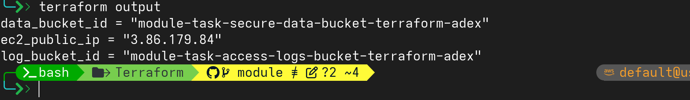

# Task: Introduce Modules on your existing Terraform stack with Variables and Outputs. You might need to create a new branch from the previous branch (not source/main branch).


## Merging branch to add variables and outputs 

```bash
# checkout to main branch
git chekout main
# merge the branch
git merge tux
```
---

## Creating new branch to add modules

```bash
git checkout -b module
```

---

## Directory structure 

```bash
.
├── main.tf
├── outputs.tf
├── variables.tf
├── module
│   ├── ec2
│   │   ├── main.tf
│   │   ├── outputs.tf
│   │   └── variables.tf
│   ├── s3_data
│   │   ├── main.tf
│   │   ├── outputs.tf
│   │   └── variables.tf
│   ├── s3_log
│   │   ├── main.tf
│   │   ├── outputs.tf
│   │   └── variables.tf
│   └── vpc
│       ├── main.tf
│       ├── outputs.tf
│       └── variables.tf
├── task_variables.auto.tfvars
├── task_variables.tfvars
```

---

## Code 

### module/vpc

#### main.tf

```bash
resource "aws_vpc" "vpc" {
  cidr_block           = "10.0.0.0/16"
  enable_dns_hostnames = true
  enable_dns_support   = true

  tags = {
    Name = var.vpc_name
  }
}

resource "aws_internet_gateway" "igw" {
  vpc_id = aws_vpc.vpc.id

  tags = {
    Name = var.igw_name
  }
}

resource "aws_subnet" "subnet" {
  vpc_id                  = aws_vpc.vpc.id
  cidr_block              = "10.0.0.0/24"
  availability_zone       = "us-east-1a"
  map_public_ip_on_launch = true

  tags = {
    Name = var.public_subnet_name
  }
}

resource "aws_route_table" "routetable" {
  vpc_id = aws_vpc.vpc.id

  tags = {
    Name = var.public_route_table_name
  }
}

resource "aws_route" "internet_route" {
  route_table_id         = aws_route_table.routetable.id
  destination_cidr_block = "0.0.0.0/0"
  gateway_id             = aws_internet_gateway.igw.id
}

resource "aws_route_table_association" "subnet_assoc" {
  subnet_id      = aws_subnet.subnet.id
  route_table_id = aws_route_table.routetable.id
}

resource "aws_security_group" "sg" {
  name        = var.security_group_name
  description = "Allow SSH and HTTP"
  vpc_id      = aws_vpc.vpc.id

  ingress {
    from_port   = 22
    to_port     = 22
    protocol    = "tcp"
    cidr_blocks = ["0.0.0.0/0"]
  }

  ingress {
    from_port   = 80
    to_port     = 80
    protocol    = "tcp"
    cidr_blocks = ["0.0.0.0/0"]
  }

  egress {
    from_port   = 0
    to_port     = 0
    protocol    = "-1"
    cidr_blocks = ["0.0.0.0/0"]
  }

  tags = {
    Name = var.security_group_name
  }
}
```

#### variables.tf

```bash
variable "vpc_name" {
  type = string
  description = "Name of the VPC"
}

variable "igw_name" {
  type = string
  description = "Name of InternetGateway"
  default = "ModuleIGW"
}

variable "public_subnet_name" {
    type = string
    description = "Name of subnet"
    default = "ModuleSubnet"
}

variable "public_route_table_name" {
    type = string
    description = "Name of Route Table"
    default = "ModuleRouteTable"
}

variable "security_group_name" {
    type = string
    description = "Name of Security group"
    default = "ModuleSecurityGroup"
}
```

#### outputs.tf

```bash
output "subnet_id" {
    description = "Public subnet id"
    value = aws_subnet.subnet.id
}

output "security_group_id" {
    description = "Security group id"
    value = aws_security_group.sg.id 
}

```
---

### module/ec2

#### main.tf 

```bash
resource "aws_instance" "lab_ec2" {
  ami           = "ami-084568db4383264d4"
  instance_type = var.instance_type
  key_name      = var.keypair

  subnet_id              = var.subnet_id
  vpc_security_group_ids = [var.security_group_id]

  root_block_device {
    volume_type           = var.volume_type
    volume_size           = var.volume_size
    delete_on_termination = var.delete_on_termination
  }

  user_data = <<-EOF
                    #!/bin/bash
                    set -x

                    export DEBIAN_FRONTEND=noninteractive

                    apt-get update -y
                    apt-get install -y nginx

                    systemctl enable nginx
                    systemctl start nginx

                    echo "Hello from Terraform" > /var/www/html/index.nginx-debian.html
                    EOF

  tags = {
    Name = var.instance_name
  }
}
```

### variables.tf

```bash
variable "instance_type" {
    type = string
    description = "Type of ec2 instance"
    default = "t3.micro"

    validation {
        condition = contains(["t2.micro", "t3.micro"], var.instance_type)
        error_message = "Instance Type must be t2.micro or t3.micro"
    }
}

variable "keypair" {
  type = string
  description = "Key Pair for EC2"
  default = "cfkey"
}

variable "volume_type" {
    type = string
    description = "EBS volume type"
    default = "gp2"

    validation {
      condition = contains(["gp2", "gp3"], var.volume_type)
      error_message = "Volume type must be gp2 or gp3"   
      }
}

variable "volume_size" {
    type = number
    description = "EBS volume size"
    default = 20
}

variable "delete_on_termination" {
    type = bool
    description = "Delete on termination for EBS volume"
    default = true
}

variable "instance_name" {
  type = string
  description = "Name of ec2"
  default = "TaskEC2"
}

variable "subnet_id" {
    type = string
    description = "subnet id for ec2"
}

variable "security_group_id" {
    type = string
    description = "security group id for ec2"
}
```
#### outputs.tf

```bash
output "public_ip" {
  description = "Public ip of ec2"
  value = aws_instance.lab_ec2.public_ip
}
```

---
## module/s3_log

#### main.tf

```bash
resource "aws_s3_bucket" "access_logs" {
  bucket = var.access_logs_bucket_name

  lifecycle {
    prevent_destroy = true
  }
}

resource "aws_s3_bucket_versioning" "access_logs" {
  bucket = aws_s3_bucket.access_logs.id

  versioning_configuration {
    status = "Enabled"
  }
}

resource "aws_s3_bucket_ownership_controls" "access_logs" {
  bucket = aws_s3_bucket.access_logs.id

  rule {
    object_ownership = "BucketOwnerPreferred"
  }

}

resource "aws_s3_bucket_public_access_block" "access_logs" {
  bucket = aws_s3_bucket.access_logs.id

  block_public_acls       = true
  block_public_policy     = true
  ignore_public_acls      = true
  restrict_public_buckets = true
}

resource "aws_s3_bucket_server_side_encryption_configuration" "access_logs" {
  bucket = aws_s3_bucket.access_logs.id

  rule {
    apply_server_side_encryption_by_default {
      sse_algorithm = "AES256"
    }
  }
}

data "aws_caller_identity" "current" {}

resource "aws_s3_bucket_policy" "access_logs" {
  bucket = aws_s3_bucket.access_logs.id

  policy = jsonencode({
    Version = "2012-10-17"
    Statement = [
      {
        Sid    = "AllowS3Logging"
        Effect = "Allow"
        Principal = {
          Service = "logging.s3.amazonaws.com"
        }
        Action   = "s3:PutObject"
        Resource = "arn:aws:s3:::${var.access_logs_bucket_name}/*"
        Condition = {
          StringEquals = {
            "aws:SourceAccount" = data.aws_caller_identity.current.account_id
          }
        }
      }
    ]
  })
}
```

#### vairables.tf

```bash
variable "access_logs_bucket_name" {
  type = string
  description = "Access logs bucket name"
}
```

#### outputs.tf

```bash
output "bucket_id" {
  description = "Log bucket id"
  value = aws_s3_bucket.access_logs.id
}
```

---
### module/s3_data

#### main.tf

```bash
resource "aws_s3_bucket" "secure_data" {
  bucket = var.secure_data_bucket_name
}

resource "aws_s3_bucket_versioning" "secure_data" {
  bucket = aws_s3_bucket.secure_data.id

  versioning_configuration {
    status = "Enabled"
  }
}

resource "aws_s3_bucket_ownership_controls" "secure_data" {
  bucket = aws_s3_bucket.secure_data.id

  rule {
    object_ownership = "BucketOwnerEnforced"
  }
}


resource "aws_s3_bucket_public_access_block" "secure_data" {
  bucket = aws_s3_bucket.secure_data.id

  block_public_acls       = true
  block_public_policy     = true
  ignore_public_acls      = true
  restrict_public_buckets = true
}


resource "aws_s3_bucket_logging" "secure_data" {
  bucket        = aws_s3_bucket.secure_data.id
  target_bucket = var.access_logs_bucket_name
  target_prefix = "data-bucket-access-logs/"
}


resource "aws_s3_bucket_server_side_encryption_configuration" "secure_data" {
  bucket = aws_s3_bucket.secure_data.id

  rule {
    apply_server_side_encryption_by_default {
      sse_algorithm = "AES256"
    }
  }
}

resource "aws_s3_bucket_policy" "secure_data" {
  bucket = aws_s3_bucket.secure_data.id

  policy = jsonencode({
    Version = "2012-10-17"
    Statement = [
      {
        Sid       = "DenyInsecureTransport"
        Effect    = "Deny"
        Principal = "*"
        Action    = "s3:*"
        Resource = [
          "arn:aws:s3:::${var.secure_data_bucket_name}",
          "arn:aws:s3:::${var.secure_data_bucket_name}/*"
        ]
        Condition = {
          Bool = {
            "aws:SecureTransport" = "false"
          }
        }
      }
    ]
  })
}
```

#### variables.tf

```bash
variable "secure_data_bucket_name" {
  type = string
  description = "Secure Data bucket name"
}

variable "access_logs_bucket_name" {
  type = string
  description = "Access logs bucket name"
}
```

#### outputs.tf

```bash
output "data_bucket_id" {
  description = "Data bucket id"
  value = aws_s3_bucket.secure_data.id
}
```
---

### Main 

#### main.tf

```bash
terraform {
  required_providers {
    aws = {
      source  = "hashicorp/aws"
      version = "~> 5.1.0"
    }
  }
  required_version = ">= 1.2"
}

provider "aws" {
  region = "us-east-1"
}

module "vpc" {
  source   = "./module/vpc"
  vpc_name = var.myvpc_name
}

module "ec2" {
  source            = "./module/ec2"
  security_group_id = module.vpc.security_group_id
  subnet_id         = module.vpc.subnet_id
}

module "access_logs_bucket" {
  source                  = "./module/s3_log"
  access_logs_bucket_name = var.access_logs_bucket_name
}

module "data_bucket" {
  source                  = "./module/s3_data"
  secure_data_bucket_name = var.secure_data_bucket_name
  access_logs_bucket_name = module.access_logs_bucket.bucket_id
}
```

#### variables.tf

```bash
variable "myvpc_name" {
  type        = string
  description = "Name of the VPC"
  default     = "TaskVPC"
}

variable "access_logs_bucket_name" {
  type        = string
  description = "Access logs bucket name"
  default     = "task-access-logs-bucket-terraform-adex"
}

variable "secure_data_bucket_name" {
  type        = string
  description = "Secure Data bucket name"
  default     = "task-secure-data-bucket-terraform-adex"
}
```

#### outputs.tf

```bash
output "ec2_public_ip" {
  description = "Public IP address of the EC2 instance"
  value       = module.ec2.public_ip
}

output "log_bucket_id" {
  description = "Access logs bucket name"
  value       = module.access_logs_bucket.bucket_id
}

output "data_bucket_id" {
  description = "Data bucket name"
  value       = module.data_bucket.data_bucket_id
}
```

#### task_variables.auto.tfvars

```bash
myvpc_name              = "NewTestVPC"
access_logs_bucket_name = "module-task-access-logs-bucket-terraform-adex"
secure_data_bucket_name = "module-task-secure-data-bucket-terraform-adex"
```
---

## Plan and Apply

```bash
# plan
terraform plan
# apply
terraform apply
```

## Output



---

## Commit nad push

```bash
git commit
git push origin module
```
---