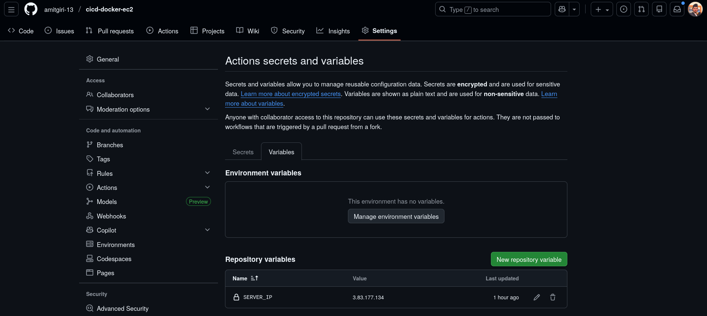
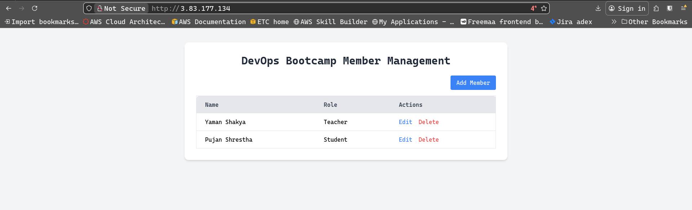

# Task: Write a CI/CD in GitHub Actions that triggers when code is changed in your repo. It should build a docker image and deploy that in EC2.

[View Code: ](https://github.com/amitgiri-13/cicd-docker-ec2)

## Directory structure

```bash
.
├── app/
├── .github
│   └── workflows
│       └── deploy.yaml
├── docker-compose.yaml
├── Dockerfile
├── requirements.txt
└── terraform/
```

---

## Code 

### Dockerfile

```bash
FROM python:3.11-slim

WORKDIR /app

COPY requirements.txt .
RUN pip install --no-cache-dir -r requirements.txt

COPY . .

CMD ["uvicorn", "app.main:app", "--host", "0.0.0.0", "--port", "8000"]
```
---

### docker-compose.yaml

```bash
services:
  app:
    build: .
    container_name: bootcamp_app
    ports:
      - "80:8000"
    restart: always
    environment:
      POSTGRES_USER: bootcamp
      POSTGRES_PASSWORD: bootcamp123
      POSTGRES_DB: bootcamp_db
      POSTGRES_HOST: db
    depends_on:
      - db

  db:
    image: postgres:15
    container_name: bootcamp_db
    restart: always
    environment:
      POSTGRES_USER: bootcamp
      POSTGRES_PASSWORD: bootcamp123
      POSTGRES_DB: bootcamp_db
    volumes:
      - postgres_data:/var/lib/postgresql/data

volumes:
  postgres_data:
```
---

## CI/CD

### deploy.yaml 

```bash
name: "Build and run docker container in EC2"

on:
  push:
    branches:
      - main

jobs:
  deploy-my-code:
    name: "Deploy my code in Docker container on EC2"
    runs-on: ubuntu-latest
    env:
      SERVER_IP: ${{ vars.SERVER_IP }}

    steps:
      - name: Checkout code
        uses: actions/checkout@v4
        with:
          fetch-depth: 0

      - name: Configure SSH
        run: |
          mkdir -p ~/.ssh
          chmod 700 ~/.ssh
          echo -e "Host *\n\tStrictHostKeyChecking no\n" > ~/.ssh/config
          chmod 600 ~/.ssh/config
          touch ~/.ssh/known_hosts
          chmod 600 ~/.ssh/known_hosts

      - name: Setup SSH key
        run: |
          echo "$SSH_KEY64" | base64 -d > mykey.pem
          chmod 400 mykey.pem
          ssh-keygen -R $SERVER_IP
        env:
          SSH_KEY64: ${{ secrets.SSH_KEY64 }}

      - name: Pull code and run Docker container
        run: |
          ssh  ubuntu@$SERVER_IP -i mykey.pem << 'EOF'
            APP_DIR="member-manager"
            REPO_URL="https://github.com/amitgiri-13/cicd-docker-ec2.git"

            # Check if repo exists
            if [ -d ~/$APP_DIR/.git ]; then
              echo "Repo exists. Pulling latest changes..."
              cd ~/$APP_DIR
              git reset --hard
              git pull origin main
            else
              echo "Repo doesn't exist. Cloning..."
              git clone $REPO_URL $APP_DIR
              cd ~/$APP_DIR
            fi

            # Build and run Docker containers
            docker compose pull
            docker compose up -d --build
          EOF
```

## Setup variables and secretes

- secretes


- variables




## Output 



---