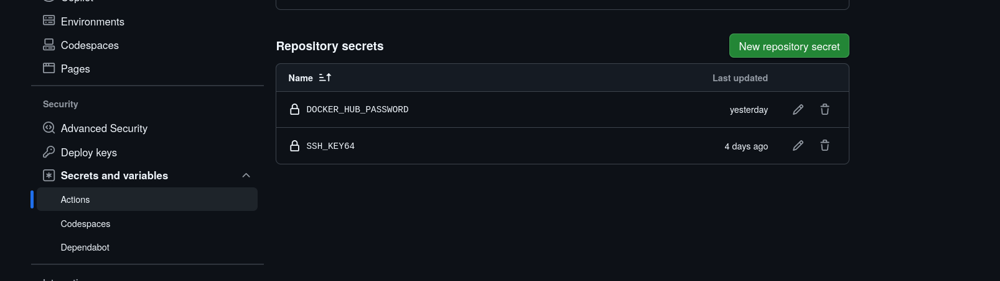

# Task: Write a CI/CD in GitHub Actions that triggers when code is changed in your repo. It should build a docker image and deploy that in EC2.

[View Code ](https://github.com/amitgiri-13/cicd-docker-ec2)

## 1. Directory structure

```bash
.
├── app/
├── .github
│   └── workflows
│       └── deploy.yaml
├── docker-compose.yaml
├── Dockerfile
├── requirements.txt
└── terraform/  # optional for dev infra provisioning
```

---

## 2. Provision Infrastructure

- i. Create EC2 with docker installed using terraform
```bash
# change directory
cd terraform

# plan
terraform plan
# apply
terraform apply
# get output
terraform output
```

- ii. Set up env file for docker containers
```bash
# ssh connection
ssh -i key.pem server_user@server_ip 

# add env file
mkdir ~/.env
touch ~/.env/dev_env 
---
``` 

- ii. Example ~/.env/dev_env file 
```bash
# App image (replace with your actual image name and tag)
APP_IMAGE=amitgiri13/manage-members:latest

# Database image
DATABASE_IMAGE=postgres:15

# Postgres environment variables
POSTGRES_USER=user123
POSTGRES_PASSWORD=pass123
POSTGRES_DB=my_db
```
---

## 3. Code 

### Dockerfile

```bash
FROM python:3.11-slim

WORKDIR /app

COPY requirements.txt .
RUN pip install --no-cache-dir -r requirements.txt

COPY . .

CMD ["uvicorn", "app.main:app", "--host", "0.0.0.0", "--port", "8000"]
```
---

### docker-compose.yaml

```bash
services:
  app:
    image: ${APP_IMAGE}
    env_file:
      - ./.env/dev_env
    container_name: bootcamp_app
    ports:
      - "80:8000"
    restart: always
    environment:
      - POSTGRES_USER=${POSTGRES_USER}
      - POSTGRES_PASSWORD=${POSTGRES_PASSWORD}
      - POSTGRES_DB=${POSTGRES_DB}
    depends_on:
      - db

  db:
    image: ${DATABASE_IMAGE}
    env_file:
      - ./.env/dev_env
    container_name: bootcamp_db
    restart: always
    environment:
      - POSTGRES_USER=${POSTGRES_USER}
      - POSTGRES_PASSWORD=${POSTGRES_PASSWORD}
      - POSTGRES_DB=${POSTGRES_DB}
    volumes:
      - postgres_data:/var/lib/postgresql/data

volumes:
  postgres_data:

```
---

## CI/CD

### deploy.yaml 

```bash
name: "Build and run docker container in EC2"

on:
  push:
    branches:
      - main
      

jobs:
  deploy-my-code:
    name: "Deploy my code in Docker container on EC2"
    runs-on: ubuntu-latest
    env:
      SERVER_IP: ${{ vars.SERVER_IP }}
      SERVER_USER: ${{ vars.SERVER_USER }}
      DOCKER_HUB_USER: ${{ vars.DOCKER_USER }}
      DOCKER_HUB_REPO: ${{ vars.DOCKER_REPO }}

    steps:
      - name: Checkout code
        uses: actions/checkout@v4
        with:
          fetch-depth: 0
      
      - name: Set up TAG
        run: |
          echo "TAG=latest" >> $GITHUB_ENV

      - name: Set up Docker Buildx 
        uses: docker/setup-buildx-action@v3

      - name: Login to Dockerhub
        run: |
          echo "${{ secrets.DOCKER_HUB_PASSWORD }}" | docker login -u $DOCKER_HUB_USER --password-stdin

      - name: Build Docker image
        run: |
          docker build -t "$DOCKER_HUB_USER/$DOCKER_HUB_REPO:$TAG" .

      - name: Push Docker image
        run: | 
          docker push "$DOCKER_HUB_USER/$DOCKER_HUB_REPO:$TAG"

      - name: Set up for SSH connection
        run: |
          mkdir -p ~/.ssh
          chmod 700 ~/.ssh
          echo -e "Host *\n\tStrictHostKeyChecking no\n" > ~/.ssh/config
          chmod 600 ~/.ssh/config 

      - name: Add private key for ssh 
        run: |
          echo "$SSH_KEY64" | base64 -d >> mykey.pem
          chmod 400 mykey.pem 
          touch ~/.ssh/known_hosts
          ssh-keygen -R $SERVER_IP
        env: 
          SSH_KEY64: ${{ secrets.SSH_KEY64 }}
      
      - name: Copy docker-compose file
        run: |
          scp -i mykey.pem ./docker-compose.yaml $SERVER_USER@$SERVER_IP:~/
      
      - name: Make ssh connection, pull and run docker image
        run: |
          ssh -i mykey.pem $SERVER_USER@$SERVER_IP "
          docker compose --env-file ./.env/dev_env pull
          docker compose --env-file ./.env/dev_env down
          docker compose --env-file ./.env/dev_env up -d
          "
```

## 4. Setup variables and secretes

- i. secretes
  - SSH_KEY64 : base 64 encoded private key to make ssh connection with ec2
  - DOCKER_HUB_PASSWORD: docker hub token with read and write access 




- ii. variables
  - DOCKER_REPO: Docke hub repository
  - DOCKER_USER: Docker hub user
  - SERVER_IP: ip of ec2
  - SERVER_USER: user of ec2


## 5. Output 


---