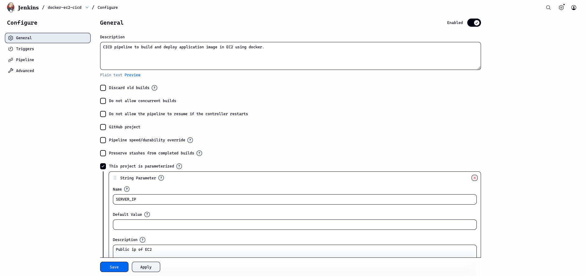
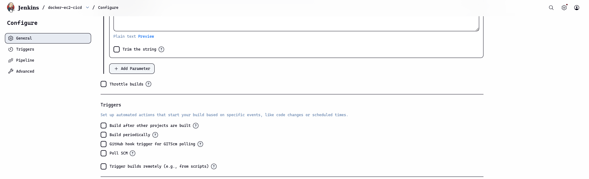
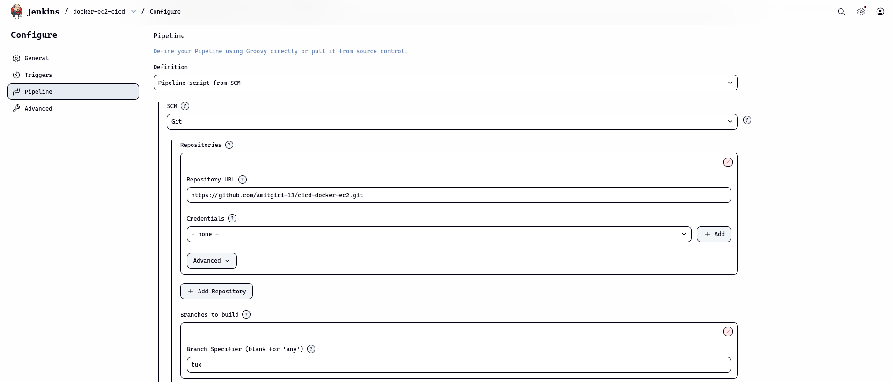
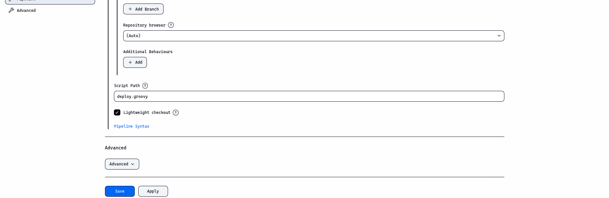
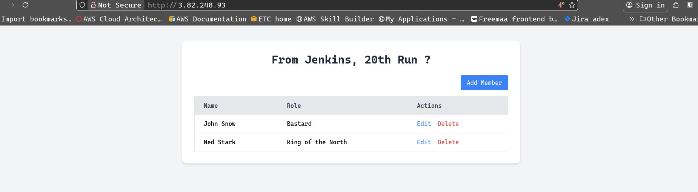

# Task: Write a CI/CD in GitHub Actions that triggers when code is changed in your repo. It should build a docker image and deploy that in EC2.

[View Code ](https://github.com/amitgiri-13/cicd-docker-ec2)

## 1. Directory structure

```bash
.
├── app/
├── docker-compose.yaml
├── Dockerfile
├── requirements.txt
├── deploy.groovy # jenkinsfile
└── terraform/  # optional for dev infra provisioning
```

---

## 2. Provision Infrastructure

- i. Create EC2 with docker installed using terraform
```bash
# change directory
cd terraform

# plan
terraform plan
# apply
terraform apply
# get output
terraform output
```

- ii. Set up env file for docker containers
```bash
# ssh connection
ssh -i key.pem server_user@server_ip 

# add env file
mkdir ~/.env
touch ~/.env/dev_env 
---
``` 

- ii. Example ~/.env/dev_env file 
```bash
# App image (replace with your actual image name and tag)
APP_IMAGE=amitgiri13/manage-members:latest

# Database image
DATABASE_IMAGE=postgres:15

# Postgres environment variables
POSTGRES_USER=user123
POSTGRES_PASSWORD=pass123
POSTGRES_DB=my_db
```
---

## 3. Code 

### Dockerfile

```bash
FROM python:3.11-slim

WORKDIR /app

COPY requirements.txt .
RUN pip install --no-cache-dir -r requirements.txt

COPY . .

CMD ["uvicorn", "app.main:app", "--host", "0.0.0.0", "--port", "8000"]
```
---

### docker-compose.yaml

```bash
services:
  app:
    image: ${APP_IMAGE}
    env_file:
      - ./.env/dev_env
    container_name: bootcamp_app
    ports:
      - "80:8000"
    restart: always
    environment:
      - POSTGRES_USER=${POSTGRES_USER}
      - POSTGRES_PASSWORD=${POSTGRES_PASSWORD}
      - POSTGRES_DB=${POSTGRES_DB}
    depends_on:
      - db

  db:
    image: ${DATABASE_IMAGE}
    env_file:
      - ./.env/dev_env
    container_name: bootcamp_db
    restart: always
    environment:
      - POSTGRES_USER=${POSTGRES_USER}
      - POSTGRES_PASSWORD=${POSTGRES_PASSWORD}
      - POSTGRES_DB=${POSTGRES_DB}
    volumes:
      - postgres_data:/var/lib/postgresql/data

volumes:
  postgres_data:

```
---

## CI/CD

### deploy.groovy

```bash
pipeline {
    agent any

    parameters {
        string(name: "SERVER_IP", description: "Public ip of EC2")
    }

    environment {
        SERVER_USER = "ubuntu"
        DOCKER_HUB_USER = "amitgiri13"
        DOCKER_HUB_REPO = "manage-members"
        TAG = "latest"
    }

    stages {

        stage("Build and Push Image") {

            steps  {

                withCredentials([
                string(credentialsId: "DOCKER_HUB_PASSWORD", variable: "DOCKER_HUB_PASSWORD")
            ]
            ){
                sh '''
                    set -e 
                    echo "$DOCKER_HUB_PASSWORD" | docker login -u $DOCKER_HUB_USER --password-stdin
                    docker build -t "$DOCKER_HUB_USER/$DOCKER_HUB_REPO:$TAG" .
                    docker push "$DOCKER_HUB_USER/$DOCKER_HUB_REPO:$TAG"
                '''
            } 
            }       
        }

        stage("Deploy To EC2") {

            steps {
                withCredentials([
                    file(credentialsId: "SSH_KEY64", variable: "SSH_KEY")
                ]) {
                    sh '''
                        set -e 
                        mkdir -p ~/.ssh
                        chmod 700 ~/.ssh
                        echo -e "HOST *\n\tStrictHostKeyChecking no\n" > ~/.ssh/config
                        chmod 600 ~/.ssh/config

                        ssh-keygen -R "$SERVER_IP"

                        scp -i $SSH_KEY ./docker-compose.yaml $SERVER_USER@$SERVER_IP:~/

                        ssh -i $SSH_KEY $SERVER_USER@$SERVER_IP "
                        docker compose --env-file ./.env/dev_env pull
                        docker compose --env-file ./.env/dev_env down
                        docker compose --env-file ./.env/dev_env up -d
                        "
                    '''
                }
            }
        }

    }
}
```

## 4. Environment Variables, Parameters and Credentials

- i. credentials
  - SSH_KEY64 : base 64 encoded private key file to make ssh connection with ec2
  - DOCKER_HUB_PASSWORD: docker hub token with read and write access 

- ii. variables
  - DOCKER_REPO: Docke hub repository
  - DOCKER_USER: Docker hub user
  - SERVER_USER: user of ec2

- iii. parameters
  - SERVER_IP: ip of ec2 

## 5. Jenkins pipeline configurations









## 5. Output 


---