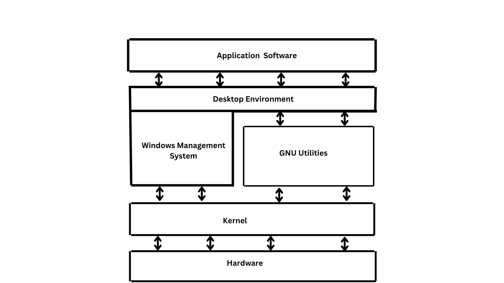

# Linux Fundamentals

**Linux** is an open-source, Unix-like operating system (OS) kernel that serves as the foundation for various operating systems. It was first created by Linus Torvalds in 1991, and since then, it has become one of the most widely used operating systems, especially in servers, embedded systems, and mobile devices.


## Linux Architecture



### Kernel

The kernel is the central part of the Linux operating system (OS), serving as the bridge between the hardware and the software. It is the most critical component of the OS, responsible for controlling and managing hardware resources, as well as providing essential services to applications and programs running on the system. The kernel operates in privileged mode, also known as kernel mode, which allows it to directly interact with the hardware.

### The GNU utilities

Kernel and GNU utilities together make Linux. They are set of essential command-line tools developed by GNU project.The GNU Project was launched by Richard Stallman in 1983. The goal of the project was to create a completely free and open-source operating system, providing users with the freedom to run, study, modify, and share software. The name GNU stands for "GNU's Not Unix," reflecting its aim to be Unix-compatible while being free software.

### Window Management Software and Desktop Environment

Window management software controls the arrangement, appearance, and behavior of application windows on a graphical interface, ensuring an organized user workspace.

A desktop environment provides a graphical user interface (GUI) that includes window management, icons, and system tools, offering a user-friendly interface for interacting with the system.

### Application Software
Application software refers to programs designed to perform specific tasks for users, such as web browsing, word processing, or multimedia editing.


[ Detail Note: Linux Architecture ](https://github.com/amitgiri-13/TechNotes/blob/main/Linux/UnderstandingLinux/general-purpose-linux-architecture.pdf)


## Linux Distributions 

A Linux distribution (often abbreviated as distro) is a version of the Linux operating system that is
packaged together with a selection of software and utilities. A Linux distribution includes the Linux
kernel, along with other essential software such as system libraries, user interfaces, and a variety
of applications. Distros are tailored to meet specific needs, preferences, and use cases, ranging from
user-friendly desktop environments to powerful server configurations.

### Distro Includes

#### Linux Kernel
The kernel is the core of the operating system and handles interactions with
hardware, system resources, and software. Different distributions may use different versions of the Linux kernel.

#### System Libraries
Libraries provide the necessary functionality for software to run. The most common
system library in Linux is the GNU C Library (glibc). Libraries help software access system resources like memory, files, and peripherals.

#### Package Management System
A package management system allows users to easily install, update, and remove
software packages. Distros use different package management tools, such as APT for Debian-based distributions, YUM/DNF for Red Hat-based distros, and pacman for Arch Linux.

#### System Utilities
These include core utilities for managing processes, networking, users, and file
systems (e.g., ls, cd, cp, ps). Essential utilities come from the GNU project and other open-source projects.

#### Desktop Environment (Optional)
A desktop environment (DE) is a graphical interface that provides a user-friendly
environment for interacting with the system (e.g., GNOME, KDE Plasma, XFCE).
Some distros come with a GUI, while others (like server-focused distros) may only
have a command-line interface (CLI).


### Types of Linux Distributions
#### Desktop Distributions
User-friendly and designed for general desktop computing.
- Ubuntu
- Linux Mint
- Fedora

#### Server Distributions
Optimized for server environments and typically don't include a GUI.
- Red Hat Enterprise Linux
- CentOS
- Ubuntu Server 

#### Rolling Release Distributions
Updated with the latest software and kernel versions.
- Arch Linux
- Manjaro

#### Specialized Distributions
Designed for specific use cases, such as security, networking, privacy etc.
- Kali Linux

[ Detail Note: Linux Distributions](https://github.com/amitgiri-13/TechNotes/blob/main/Linux/UnderstandingLinux/linux-distribution-explained.pdf)

## Components of Linux

| **Component**       | **Description** |
|---------------------|-----------------|
| **Bootloader**      | A small program that initializes the system and starts the operating system. Parrot Linux, for example, uses **GRUB** as its bootloader. |
| **OS Kernel**       | The core of the operating system responsible for managing hardware resources and handling communication between software and hardware devices. |
| **Daemons**         | Background services that run after the system boots or a user logs in. They handle essential tasks like scheduling, printing, networking, and multimedia functions. |
| **OS Shell**        | The command-line interface allowing users to interact with the system. Popular shells include **Bash**, **Zsh**, **Fish**, **Ksh**, and **Tcsh/Csh**. |
| **Graphics Server** | The subsystem that provides graphical capabilities. Often referred to as the **X server**, it enables graphical applications to run locally or remotely. |
| **Window Manager**  | The graphical interface layer that manages windows and desktop elements. Desktop environments like **GNOME**, **KDE**, **MATE**, **Unity**, and **Cinnamon** include tools such as file managers and web browsers. |
| **Utilities**       | Programs and tools designed to perform specific tasks for users or other applications, ranging from file management to system monitoring. |


## File System Hierarchy

Ever heard **Everything is a file** in Linux ?


| **Directory** | **Description** |
|---------------|-----------------|
| **/** | The root directory of the system. It holds all files needed to start the OS before other partitions are mounted. After the system boots, additional filesystems attach here under their respective subdirectories. |
| **/bin** | Stores essential user command binaries required for basic system operations. |
| **/boot** | Contains the static bootloader files, the kernel image, and everything necessary to start the Linux system. |
| **/dev** | Includes device files that act as interfaces to the hardware components connected to the machine. |
| **/etc** | Houses system-wide configuration files, along with settings for various installed applications. |
| **/home** | Keeps personal directories for all normal users, where they can store their files and data. |
| **/lib** | Holds shared libraries essential for booting and running basic system programs. |
| **/media** | Automatically used for mounting removable devices like USB drives and external disks. |
| **/mnt** | A temporary location where administrators can manually mount additional filesystems. |
| **/opt** | Used for optional or third-party software that doesn’t fit into the standard directory structure. |
| **/root** | The home folder for the system’s root (superuser) account. |
| **/sbin** | Contains system administration commands and binaries generally used by the root user. |
| **/tmp** | Temporary workspace for the OS and applications to store short-lived files. This directory is often cleared during system reboot. |
| **/usr** | Holds user applications, documentation, libraries, and other system resources. Much of the system’s software lives here. |
| **/var** | Stores variable data such as logs, mail spools, databases, cache files, and web-related content—anything that tends to grow over time. |

## The Shell

A **shell** in Linux is a program that provides a command-line interface (CLI) between the user and the operating system. It processes the commands typed by the user, interprets them, and forwards them to the kernel for execution. Through the shell, users can run programs, manage files, and control various aspects of the system.

---

## **Types of Shells in Linux**

Linux offers multiple shell environments, each with its own features and user experience:

### **1. Bash (Bourne Again Shell)**
- Default shell on many Linux distributions like Ubuntu, Fedora, and CentOS.  
- Extends features from the original Bourne Shell (`sh`) and others like `csh` and `ksh`.  
- Supports scripting, automation, command history, and tab completion.  
- Highly flexible and widely used for writing shell scripts.

### **2. Zsh (Z Shell)**
- A powerful and interactive shell with advanced features like extended globbing, syntax highlighting, and smart autocompletion.  
- Highly customizable; often preferred by advanced users.  
- Commonly paired with **Oh-My-Zsh** for added themes and plugins.

### **3. Fish (Friendly Interactive Shell)**
- Designed for simplicity and ease of use.  
- Provides autosuggestions, syntax highlighting, and user-friendly features out of the box.  
- Great for beginners, though not as script-compatible with POSIX as Bash.

### **4. Tcsh (TENEX C Shell)**
- An improved version of the C Shell (`csh`).  
- Adds command-line editing and auto-completion.  
- Historically favored by users familiar with C-like syntax.

### **5. Ksh (Korn Shell)**
- A classic shell that supports both command execution and scripting.  
- Includes features from both Bash and C Shell, such as job control and functions.

### **6. Dash (Debian Almquist Shell)**
- A fast and lightweight POSIX-compliant shell.  
- Used by many Debian-based systems for system scripts due to its efficiency.

---

## **Key Functions and Features of a Linux Shell**

### **1. Command Interpretation**
- The shell reads and interprets commands entered by the user.  
- Identifies the appropriate program or utility for execution and communicates with the kernel.

### **2. Command-Line Editing**
- Users can navigate and edit previous commands using arrow keys and shortcuts.  
- Bash (using `readline`) offers autocompletion, history navigation, and editing features.

### **3. Scripting**
- Shells can execute scripts: files containing a sequence of commands.  
- Useful for automation tasks such as backups, system monitoring, and file management.

### **4. Environment Variables**
- The shell manages variables that store system and user-specific information.  
  Common examples:  
  - **PATH** – Directories searched for executable files  
  - **HOME** – User's home directory  
  - **USER** – Currently logged-in username  

### **5. Input and Output Redirection**
- Shells support redirection and piping to control data flow:  
  - `>` or `>>` – Redirect command output to a file  
  - `<` – Read input from a file  
  - `|` – Send output of one command into another as input

### **6. Job Control**
- Allows managing foreground and background processes.  
- Common commands:  
  - `bg` – Resume a job in the background  
  - `fg` – Bring a job to the foreground  
  - `jobs` – List active jobs  

### **7. Shell Prompt**
- The shell displays a prompt indicating that it's ready to accept commands.  
- Prompts can be customized to show details like username, hostname, or current directory.  
- A common Bash prompt example:  
  ```bash
  user@hostname:~$

[Detail Note: Shell](https://github.com/amitgiri-13/TechNotes/blob/main/Linux/UnderstandingLinux/linux-shell-explained.pdf)