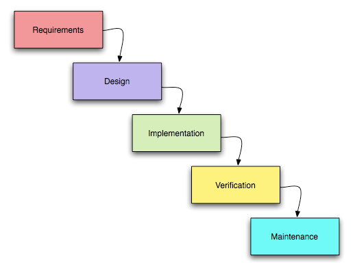
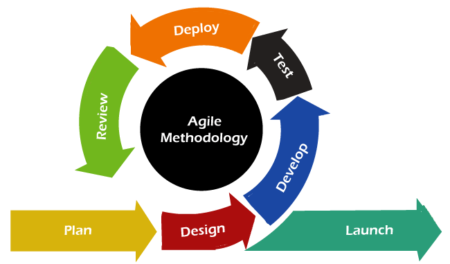

# Software Devlopment Lifecycle (SDLC)

The **Software Development Life Cycle (SDLC)** is a structured process that is used to design, develop, and test high-quality and maintainable software that meets the user's requirements i.e time, budget, specifications etc. 

### **Defining the Scopes**
Defines the project scope, objectives, timelines, budget, and resources. It ensures everyone understands what needs to be built and whether it is feasible.

**Key activities:**
- Requirements gathering
- Analysis
- Cost estimation  
- Scheduling  
- Risk identification  

### **Architecture and Design**
Creates the technical blueprint of the system. This includes deciding the system architecture, database design, UI/UX layout, and how different components will interact.

**Includes:**
- High-level design (HLD) : Overall system structure
- Low-level design (LLD) : Internal details of each modules
- Database design : ER diagrams and schemas
- UI/UX design : Look and feel of the system

### **Development**
Developers write the actual code based on the approved design. Each module or feature is built, reviewed, and prepared for integration.

**Output:**  
- Working software modules

### **Integration and Testing**
All developed modules are combined and tested as a complete system. QA checks for bugs, performance issues, and ensures the software meets requirements.

**Types of tests:**
- Unit testing  
- Integration testing  
- System testing  
- User Acceptance Testing (UAT)

### **Maintenance**
After deployment, the software is monitored and updated. Bugs are fixed, new features may be added, and optimizations are made to keep the system running smoothly.

**Maintenance types:**
- Corrective  
- Adaptive  
- Perfective  

## Why SDLC ?

- Ensures a clear plan before development starts  
- Reduces cost and rework  
- Improves product quality  
- Helps teams collaborate effectively  
- Provides predictable timelines and milestones  

---

# SDLC Models

**SDLC models** are structured approaches or frameworks that define how the SDLC is carried out. Each model provides a different way to organize the pahses like planning, design, development, testing, and maintenance.

## Popular SDLC Models

- **Waterfall Model** – Sequential, simple, rigid  
- **Agile Model** – Iterative, collaborative, flexible  
- **Spiral Model** – Risk-driven, good for large projects  

## Waterfall Model

**Waterfall Model** is a linear, step-by-step model where each phase must be completed before moving to the next. It is best for small and well-defined projects.

### **Pros**
- Simple and easy to follow  
- Clear documentation for each phase  

### **Cons**
- Not flexible to requirement changes  
- Testing happens late in the process  

## Agile Model

**Agile Model** is an iterative and flexible approach where development happens in small cycles or sprints. This model is adaptive to changing requirements. 

### **Pros**
- Highly flexible and adaptable  
- Delivers working software quickly in iterations  

### **Cons**
- Less predictable in terms of time and cost  
- Requires an experienced and collaborative team  
---
## Summary

SDLC helps teams build software in a controlled, predictable, and organized way. It ensures that every step, from planning to maintenance is executed with purpose, reducing risks and improving software quality.
