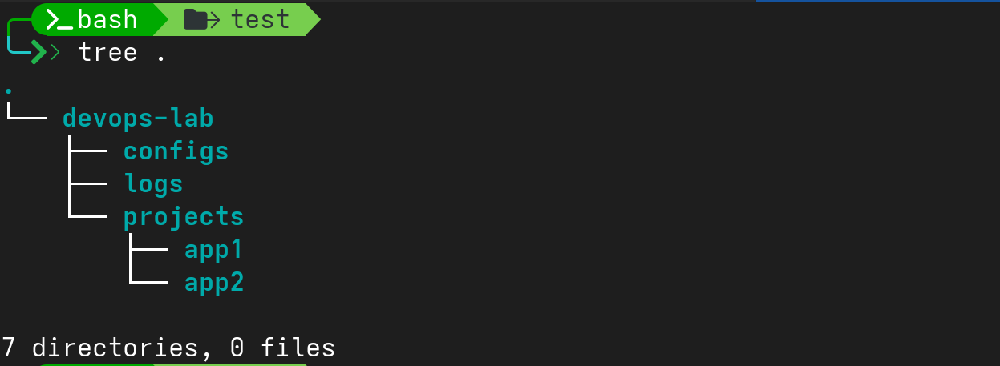

## Task 1: Linux Command Line Basics

1. Create the following directory structure:
```bash 
    ~/devops-lab/
        - projects/
            - app1/
            - app2/
        — configs/
        - logs/
```
-   Commands:
```bash
    mkdir -p devops-lab/projects/app1
    mkdir -p devops-lab/projects/app2
    mkdir devops-lab/configs
    mkdir devops-lab/logs
    tree .
```

- Output:
    

---

2. Navigate to `~/devops-lab/projects/app1/`and create a file called `README.md`

- Command:
```bash
cd devops-lab/projects/app1
touch README.md
```
- Output


---

3.  Copy `README. md` to `app2/` directory

-   Commands:
```bash
cp README.md ../app2/
ls ../app2
```

- Output:


---

4.  List all files in `~/devops-lab/` recursively showing hidden files
-   Commmands:
    ```bash
    ls -alR
    ```
    

---