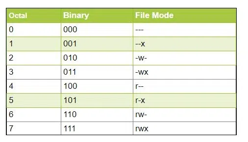

# Command-Line Fundamentals

## Shell
The interpreter that executes commands typed as strings. 

---

## Terminal
An interface that provides a display for output and a keyboard for input to a shell session.

---

## Terminal Emulator
Software that emulates the function of a terminal. It allows the use of text-based programs within a graphical user interface (GUI).

---

## Prompt
The visual cue that indicates an interactive shell is waiting for the user to type a command.

### Privileged Prompt: Root Shell Prompt

Used for root and has the **#** symbol.  

```bash
root@host:#
```

### Unprivileged Prompt: User Shell Prompt
Used for users and has the **$** symbol.

```bash
user@host:$
```

---

## General Command Structure

Let's see general command structure.
```bash
command                                         # just command
command [options..]                             # command with option/s
command [arguments..]                           # command with argument/s
command [option=value]                          # options may take values                 
command [options..] [arguments..]               # command with options and arguments
command subcommand [options..] [arguments..]    # command may have subcommands
```
The command structure can get complex, with time we get used to it.

### Command

Command is the name of a program to run. It is an executable, generally searched in **$PATH** environment variable. 

### Option
 
Option is the part of the command line that adjusts the behavior of a
command.

### Argument

Argument Specifies the target file, directory, or value that the command acts on.

---

## Let's echo 
```bash
echo "hello world"      # prints given string 
````

## Switch Users

1. Switch to root user
```bash 
su -
``` 

2. Switch to user
```bash
su <user_name>
```
3. Exit
```bash 
exit
``` 

---

## What is sudo ?

sudo is used to gain privilage to run certain commands. The user must be present in  *sudo* or *wheel* group. 

``` bash
user@host:$ sudo command
```
---

## Navigation

1. Print Present Working Directory
```bash 
pwd
```

2. List Contents of Present Working Directory
```bash
ls          # normal
ls -l       # long listnig format
ls -a       # list hidden files as well
ls -la      # long listing and hidden files 
``` 

2. Create New Directory
```bash
mkdir <dir1>            # create empty directory 
mkdir -p <dir1>/<dir2>  # create nested directory, doesn't throw error if directory exists
```

3. Delete Directory
```bash
rmdir <dir>             # remove empty directory
rm -r <dir>             # remove non empty directory recursively
rm -rfv <dir>            # -f: force delete,  -v: verbose output
```

4. Change Present Working Directory

*Absolute Path* always starts form /.

*Relative Path* starts from current working directory.
- .  -> Represents current directory
- .. -> Represents parent directory

```bash
cd /absolute/path/to/dir    # visit  given directory from anywhere
cd ..                       # vist  parent directory of current directory
cd ./dir                    # visit dir directory within current working directory
cd -                        # visit last visited directory 
```
---

## File Management

1. Create New File
```bash
touch <file_name>       # if file already exists it updates the timestamp
```


2. Copy File/Directory
```bash
cp <source> <destination>   # copies file or directory to destination
cp -r <source-dir> <destination-dir> # copies directory recursively
```
3. Move/Rename File
```bash
mv <source> <destination>   # moves or renames file/directory
```

4. Remove File/Directory
```bash
rm <file_name>              # deletes a file
rm -r <directory_name>      # deletes a directory recursively
```

5. View File Content
```bash
cat <file_name>             # displays entire content of a file
```

6. View Start of File
```bash
head <file_name>            # shows first 10 lines of a file by default
head -n <lines> <file_name> # shows first <lines> lines
```

7. View End of File
```bash
tail <file_name>            # shows last 10 lines of a file by default
tail -n <lines> <file_name> # shows last <lines> lines
```

8. Find Files
```bash
find <path> -name <pattern> # searches for files matching pattern under path
```

9. Locate Files (faster search using database)
```bash
locate <file_name>          # finds file paths using prebuilt database
```

10. Search Text in Files
```bash
grep <pattern> <file_name>  # searches for pattern in the file
grep -r <pattern> <dir>     # searches recursively in a directory
```

11. Compare Files
```bash
diff <file1> <file2>        # shows line-by-line differences between two files
```

12. File Archival and Extraction
```bash
tar -cvf archive_name.tar <files_or_directories>  
# -c: create archive, -v: verbose, -f: specify archive file name

tar -xvf archive_name.tar  
# -x: extract archive, -v: verbose, -f: specify archive file name

tar -xvf archibe_name.tar -C <directory> 
# extract in given directory

tar -czvf archive_name.tar.gz <files_or_directories>  
# -z: compress with gzip

tar -xzvf archive_name.tar.gz  
# -x: extract, -z: decompress gzip, -v: verbose, -f: file

rsync -avz /source /destination                 # sync with compression and archive mode
``` 

---

## System Information and Monitoring

1. Display Running Processes
```bash
top                 # display running processes and system usage in real-time
ps                  # show current processes
ps aux              # detailed list of all running processes
```

2. Check Disk Usage
```bash
df -h               # disk space usage readable format
df -T               # show filesystem types and disk usage
```

3. Check Directory Size
```bash
du -h <dir>         # show directory size in readable format
du -sh <dir>        # show total size of directory
```

4. Check Memory Usage
```bash
free  -h        # show memory usage in readable format
```

5. System Uptime
```bash
uptime -p      # uptime in pretty format
```

6. System Information
```bash
uname -a        # show system information
uname -r        # kernel version
```

7. Current Logged-in User
```bash
whoami          # display the current user
id              # shows user ID and group ID
```

8. Show Groups of a User
```bash
groups
```
---

## Process Management

1. Send Signal To Process
```bash
kill <pid>              # kill a process by process ID (default signal SIGTERM)
kill -9 <pid>           # force kill (SIGKILL)
kill 19 <pid>           # stop a process (SIGSTOP)
kill -18 <pid>          # continue a stopped process (SIGCONT)
```

2. Background Jobs
```bash
jobs                    # list background/suspended jobs
bg %[job number]        # resume a stopped job in background
fg %[job number]        # bring job to foreground
```

---

## File Permissions Management

*Be cautious while performing these operations*




 

1. Change Permission
```bash 
chmod 400 <file>            # only owner can read file
chmod 777 <file>            # read, write, and execute for owner, group and others
chmod -R 400 <directory>    # apply permissions to all files and sub-directories
```

2. Change Owner and Group
```bash
sudo chown user:group <file>          # change user and group of file
sudo chown -R user:group <directory>  # change ownership recursively for all files in a directory
```
---

## Networking

1. Download Data With curl and wget
```bash
curl <url>                  # view content of webpage in terminal
curl <url> -O <file_name>   # download and save with a specific name

wget <https://example.com/file.txt> # download a file
wget <https://example.com/file.txt> -O <file_name> # download and save with a specific name
wget -r <https://example.com/folder/>  # download recursively
```

2. Get IP Address and Network Interfaces
```bash
ip addr show
```

3. Check Host Reachablility
```bash
ping <ip or DNS name>   # check connectivity with ICMV requests

nc -zv <ip> <port>      # scan for open ports

telnet example.com      # check connectivity on default telnet port 23
telnet example.com 80   # connect ot specific port

```

4. DNS Query
```bash
dig example.com     # query a record

nslookup example.com            # query a record
nslookup example.com 8.8.8.8    # query using a specific DNS server
```

5. SSH Connection
```bash
ssh  user@host_ip       
ssh -i <key.pem>    user@host_ip    # specify key file with -i 
```

6. Copy File To and From Remote Server Over SSH
```bash
scp -i <key.pem>    <source_file>  user@host_ip:/destination/path    # copy file to remote server

scp -i <key.pem>    user@host_ip:/source/file   <destination>        # copy file from remote server
```
---

## Package Management

*Be cautious while performing these operations*

Learn based on the distro used.

1. **pacman** For Arch Based
```bash
sudo pacman -Suy            # update system
sudo pacman -S <package>    # install package
suod pacman -R <package>    # remove package 
sudo pacman -Rns <package>  # remove package with unused dependencies and configs
sudo pacman -Ss  <keyword>  # search for package
sudo pacman -Q              # list all packages installed
suod pacman -Scc            # remove all cache
```

2. ***apt** For Debian/Ubuntu Based 
```bash
sudo apt update                 # update package database
sudo apt upgrade                # upgrade installed packages
sudo apt full-update            # handles dependency changes
sudo apt install <package>      # install package
sudo apt remove <package>       # remove package
sudo apt purge   <package>      # remove package with config files
sudo apt autoremove             # remove unused dependencies
apt search <keyword>            # search for package
apt list --installed            # list packages
sudo apt autoclean              # remove all cache
```

3. **yum** For RHEL/CentOS/Fedora
```bash
sudo yum ckeck-update           # check for updates
sudo yum update                 # update packages
sudo yum install <package>      # install package
sudo yum remove <package>       # remove package
yum search <keyword>            # search packages
yum list installed              # list installed packages
sudo yum clean all              # clean cache
```

4. **dnf** For RHEL/CentOS/Fedora
```bash
sudo dnf update                 # update packages
sudo dnf install <package>      # install pckages
sudo dnf remove <package>       # remove packages
dnf search <keyword>            # search packages
dnf list installed              # list installed packages
sudo dnf clean all              # clean cache
```

---

## User Management

*Be cautious while performing these operations*

1. Add User
```bash
sudo useradd -m -d /home/<username> -s /bin/bash -c "User Full Name" <username>
# -m → creates home directory
# -d → specify home directory
# -s → default shell
# -c → comment / full-name field
```

2. Change Password
```bash
sudo passwd <username>
sudo passwd -e <username>  # force change in next login
```

3. Modify User
```bash
sudo usermod -d /new/home/dir -m <username>     # change home directory
sudo usermod -aG <groupname> <username>         # add user to group
sudo usermod -s /bin/zsh <username>             # change login shell
```

4. Delete User
```bash
sudo userdel <username>
sudo userdel -r <username>          # delete user and home directory
```

5. Add Group
```bash
sudo groupadd <groupname>
```

6. Delete Group
```bash
sudo groupdel <groupname>
```

---

## Disk Management

*Be cautious while performing these operations*

**Workflow**

**Identify Disk -> Create Partitions (optional) -> Create Filesystem -> Mount -> Use -> Unmount**

1. List Block Devices
```bash
lsblk
```

2. List Disks and Partitions
```bash
sudo fdisk -l                   # list all disks and partitions
sudo fdisk -l /dev/sdX          # list partitions of a disk
``` 

3. Create Partitions


Be cautious ! if it's first time try with a experimental external disk.
```bash
sudo fdisk /dev/sdX                     # open disk in fdisk interactive mode
m  # show help
p  # show partition table
n  # create new partition
d  # delete a partition
t  # change partition type
L  # view known partition type
w  # write changes to disk
q  # quit without saving
```

4. Create a Filesystem
```bash
sudo sudo mkfs.ext4 /dev/sdX1               # ext4 filesystem
sudo mkfs.vfat -F 32 /dev/sdX1              # fat32 filsystem
sudo mkfs.xfs /dev/sdX1                     # xfs filesystem
```

5. Mount and Unmount Disk
```bash
sudo mount /dev/sdX1 /mnt                   # mount /dev/sdX1 in /mnt directory
sudo umount /dev/sdX1                       # unmount /dev/sdX1
#or
sudo umount /mnt    
```

6. Check and Repair Filesystem
```bash
sudo fsck /dev/sdX1                    # check filesystem
sudo fsck -y /dev/sdX1                 # auto repair filesystem
```
---