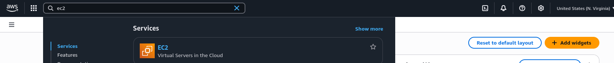
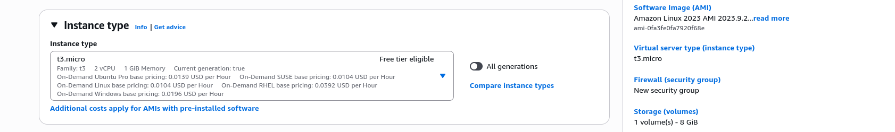
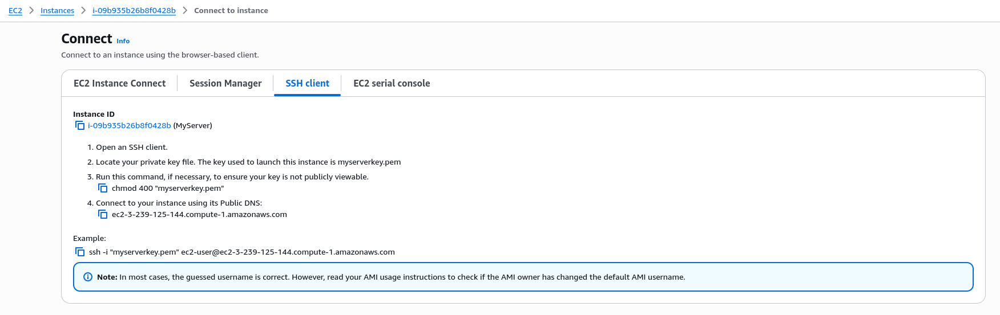

# Launching EC2 Instance and Making SSH Connection

An EC2 instance is a virtual server in the AWS Cloud. When we launch an EC2 instance, the instance type that we specify determines the hardware available to our instance. Each instance type offers a different balance of compute, memory, network, and storage resources. 

Visit **[AWS Documentation: EC2](https://docs.aws.amazon.com/ec2/)**

 ---

## Launch EC2 Instance

We are about to launch an EC2 instance with most of the default settings for learning purpose. 

1. **In AWS management console search for ec2 and select it.**



2. **Proceed witch launch instance.**


3. **Give a name to the server.**


4. **Select OS image.**


5. **Select the instance type.**



6. **Proceed with create new key pair.**


8. **Select key type, file format and proceed with create key pair.**


8. **Let the  vpc be default vpc. Create a security group to allow ssh. Keep other settings as default and proceed with launch instance.**


9. **Select the created ec2 instance to  view it's detail.**


---

## SSH Connection

An SSH (Secure Shell) connection establishes a secure and encrypted communication channel between two computers, typically a local client and a remote server, over an insecure network. 

1. **Click on Connect.**


2. **Select SSH client. Copy the Example command.**



3. **In local device run the following commands.**

```bash
nc -zv 3.239.125.144 22      # checking for connectivity in port 22
```


```bash
chmod 400 myserverkey.pem               # read only permission to owner only
ssh -i "myserverkey.pem" ec2-user@ec2-3-239-125-144.compute-1.amazonaws.com  # make ssh connection
# if prompted as follow for fingerprint type 'yes'
```


---

## Summary

The launched EC2 instance with Amazon Linux image is in default VPC, with a security group that allows SSH connection only. Public IP or public DNS name of the instance is used to connect to the instance. 

With the help of SSH client in local device SSH connection is successfully made to EC2 instance. The SSH client establishes connection taking private key, username and instance's public IP/DNS name specified in ssh command.

---