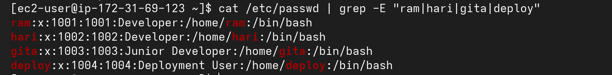
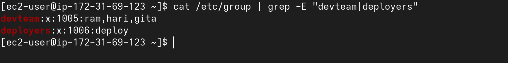
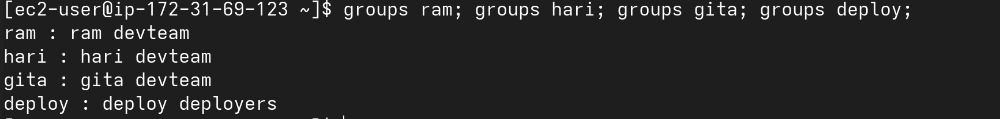

# Task 1: User and Group Creation

Scenario You are a DevOps engineer at a XYZ company. The development team works
on a shared project located in /var/www/project . Multiple developers and a
deployment user need different levels of access. You must set up proper users,
groups, and permissions to ensure security and collaboration.

---

1. **Create the following users:**
```bash 
    - ram (developer)
    - hari (developer)
    - gita (junior developer - limited access)
    - deploy (deployment user - used by CI/CD)
```

- Commands

```bash
sudo useradd -c "Developer" ram
sudo passwd ram

sudo useradd -c "Developer" hari
sudo passwd hari

sudo useradd -c "Junior Developer" gita
sudo passwd gita

sudo useradd -c "Deployment User" deploy
sudo passwd deploy
```
- Output

```bash
cat /etc/passwd | grep -E "ram|hari|gita|deploy"  # view user's detail
```


---

2. **Create the following groups:**
```bash
devteam
deployers
```

- Commands

```bash
sudo groupadd devteam
sudo groupadd deployers
```

- Output

```bash
cat /etc/group | grep -E "devteam|deployers"  # view group details
```


---

3. **Add users to groups:**
```bash
    - ram and hari -> devteam
    - gita -> devteam with restricted write access later
    - deploy -> deployers
```

- Commands

```bash
sudo usermod -aG devteam ram
sudo usermod -aG devteam hari
sudo usermod -aG devteam gita
sudo usermod -aG deployers deploy
```

- Outputs

```bash
groups ram; grops hari; groups gita; groups deploy;   # command chaining with ;
```



---