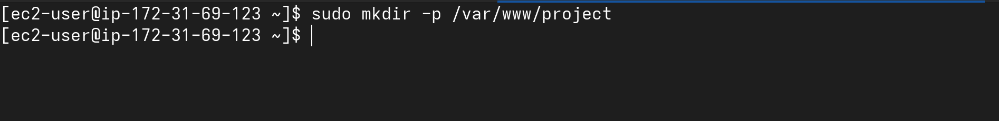

# Task 2: Dierctory and File Setup

Scenario You are a DevOps engineer at a XYZ company. The development team works
on a shared project located in /var/www/project . Multiple developers and a
deployment user need different levels of access. You must set up proper users,
groups, and permissions to ensure security and collaboration.

---

1. **Create the project directory:**
```bash
/var/www/project
```

- Command

```bash
sudo makdir -p /var/www/project
```
- Output


---

2. **Insid /var/www/project, create:**
```bash
    - source/ ( source code - only devteam can read/write )
    - logs/   ( logs - everyone in devteam can append, but not delter other's files )
    - scripts/ ( deployment scripts - only deploy user can execute some scripts )
    - shared/  ( shared assets - all devteam can read/write, new files inherit group)
```

- Command

```bash
sudo mkdir -p /var/www/project/{source,logs,scripts,shared}
ls /var/www/project/
```


- Output


---